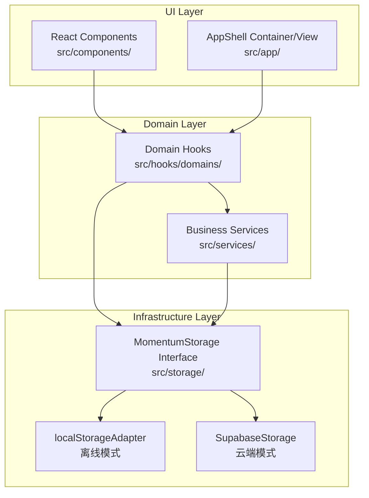
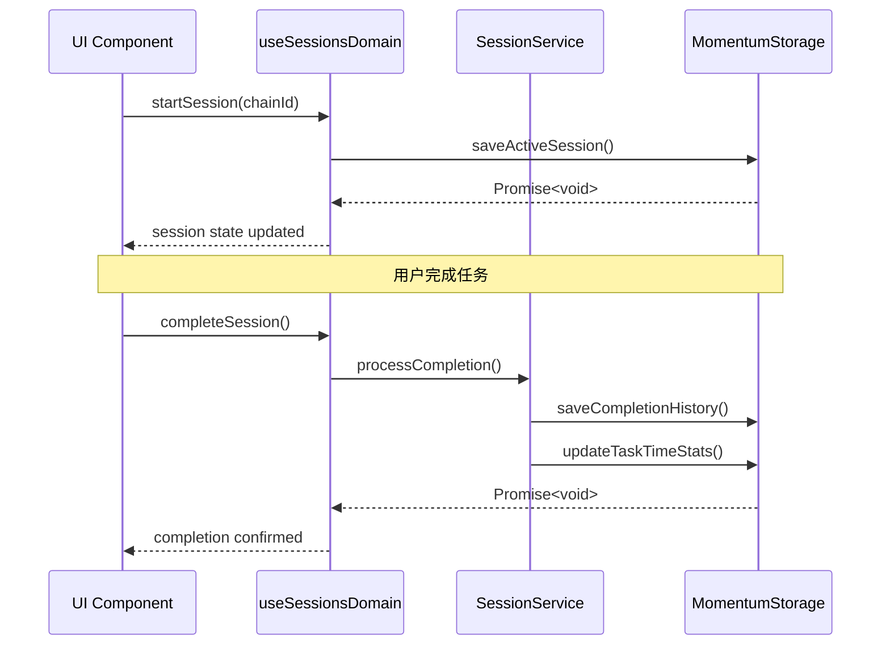
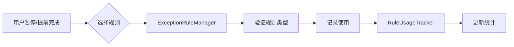

# Momentum 架构总览

本文档描述 Momentum 项目的整体架构设计，旨在帮助开发者和 AI 助手快速理解代码结构。

---

## 三层架构



### 层级职责

| 层级 | 目录 | 职责 | 规则 |
|------|------|------|------|
| **UI** | `src/components/`, `src/app/` | 纯展示、用户交互 | 禁止直接访问存储 |
| **Domain** | `src/hooks/domains/`, `src/services/` | 业务逻辑、状态管理 | 通过 `useStorage()` 访问数据 |
| **Infrastructure** | `src/storage/`, `src/infra/` | 数据持久化 | 实现 `MomentumStorage` 接口 |

---

## 核心设计模式

### Container/View 模式

大型组件拆分为容器（状态/逻辑）和视图（纯展示）：

```
AppShellContainer.tsx  ←→  AppShellView.tsx
FocusModeContainer.tsx ←→  FocusModeView.tsx
ChainEditorContainer.tsx ←→ ChainEditorView.tsx
```

**目标**：每个文件 < 300 行

### 存储抽象

```typescript
// 通过 storage.kind 判断当前模式
const storage = useStorage();
if (storage.kind === 'supabase') {
  // 云端特有逻辑
}
```

---

## 关键文件速查

### Domain Hooks（业务领域）

| 领域 | Hook 文件 | 职责 | 依赖服务 |
|------|-----------|------|----------|
| **Chains** | `useChainsDomain.ts` | 任务链 CRUD | - |
| **Sessions** | `useSessionsDomain.ts` | 会话生命周期管理 | `SessionService` |
| **Betting** | `useBettingDomain.ts` | 赌注模式逻辑 | `BettingService` |
| **Rules** | `useRulesDomain.ts` | 例外规则管理 | `ExceptionRuleManager` |
| **RecycleBin** | `useRecycleBinDomain.ts` | 回收箱（软删除） | `RecycleBinService` |
| **RSIP** | `useRsipDomain.ts` | 递归稳态迭代协议 | - |
| **Groups** | `useGroupDomain.ts` | 任务群管理 | - |
| **Pet** | `usePetDomain.ts` | 虚拟宠物系统 | - |
| **Checkin** | `useCheckinDomain.ts` | 每日签到 | `CheckinService` |
| **ImportExport** | `useImportExportDomain.ts` | 数据导入导出 | - |
| **SafeSave** | `useSafeSaveChains.ts` | 链条安全保存 | - |

### Business Services（业务服务）

| 服务 | 文件 | 职责 |
|------|------|------|
| **ExceptionRuleManager** | `ExceptionRuleManager.ts` | 例外规则核心管理 |
| **RuleScopeManager** | `RuleScopeManager.ts` | 规则作用域管理 |
| **RuleStateManager** | `RuleStateManager.ts` | 规则状态管理 |
| **RecycleBinService** | `RecycleBinService.ts` | 回收箱操作 |
| **BettingService** | `BettingService.ts` | 赌注系统 |
| **SessionService** | `SessionService.ts` | 会话管理 |
| **CheckinService** | `CheckinService.ts` | 签到逻辑 |
| **UserSettingsService** | `UserSettingsService.ts` | 用户设置 |
| **RealTimeSyncService** | `RealTimeSyncService.ts` | 实时同步 |
| **DataIntegrityChecker** | `DataIntegrityChecker.ts` | 数据完整性校验 |
| **ErrorRecoveryManager** | `ErrorRecoveryManager.ts` | 错误恢复 |
| **SystemHealthService** | `SystemHealthService.ts` | 系统健康监控 |

### Infrastructure（基础设施）

| 模块 | 文件 | 职责 |
|------|------|------|
| **Storage Interface** | `src/storage/MomentumStorage.ts` | 存储契约定义（96行，40+方法） |
| **Local Adapter** | `src/storage/localStorageAdapter.ts` | 离线存储实现 |
| **Supabase Storage** | `src/infra/storage/supabase/SupabaseStorage.ts` | 云端存储实现 |
| **Auth** | `src/infra/storage/supabase/auth.ts` | 认证模块 |
| **Chains** | `src/infra/storage/supabase/chains.ts` | 链条数据 |
| **Sessions** | `src/infra/storage/supabase/sessions.ts` | 会话数据 |
| **Betting** | `src/infra/storage/supabase/betting.ts` | 赌注数据 |
| **Checkin** | `src/infra/storage/supabase/checkin.ts` | 签到数据 |
| **RSIP** | `src/infra/storage/supabase/rsip.ts` | RSIP 数据 |
| **Mappers** | `src/infra/storage/supabase/mappers.ts` | 数据映射器 |
| **Retry** | `src/infra/storage/supabase/retry.ts` | 重试逻辑 |

---

## 类型系统

### 核心类型定义

位置：`src/types/index.ts`（457 行）

```typescript
// 链条 - 使用 Discriminated Union
type Chain = UnitChain | GroupChain;

// 链条类型
type ChainType =
  | 'unit'          // 基础单元
  | 'group'         // 任务群容器
  | 'assault'       // 突击单元（学习、实验）
  | 'recon'         // 侦查单元（信息搜集）
  | 'command'       // 指挥单元（制定计划）
  | 'special_ops'   // 特勤单元（处理杂事）
  | 'engineering'   // 工程单元（运动锻炼）
  | 'quartermaster' // 炊事单元（备餐做饭）

// 表单处理 - 使用 DistributiveOmit 保持联合类型
type ChainDraft = DistributiveOmit<Chain, ChainSystemFields>;
```

### 类型文件分布

| 文件 | 内容 |
|------|------|
| `src/types/index.ts` | Chain, Session, Rule, RSIP, History 等核心类型 |
| `src/types/pet.ts` | 宠物系统类型 |
| `src/domain/auth.ts` | 认证相关类型 |
| `src/domain/betting.ts` | 赌注系统类型 |
| `src/domain/checkin.ts` | 签到类型 |
| `src/domain/result.ts` | `Result<T, E>` 模式 |
| `src/domain/errors.ts` | 错误类型定义 |
| `src/domain/userSettings.ts` | 用户设置类型 |

---

## 数据流

### 任务执行流程



### 例外规则应用流程



---

## 全局服务生命周期

在 `AppShellContainer.tsx` 中管理：

```typescript
// 启动时
useEffect(() => {
  forwardTimerManager.start();
  exceptionRuleCache.start();
  ruleStateManager.start();
  if (isDev) {
    performanceDashboard.start();
  }

  return () => {
    forwardTimerManager.stop();
    exceptionRuleCache.stop();
    ruleStateManager.stop();
    performanceDashboard.stop();
  };
}, []);
```

---

## 目录结构

```
src/
├── app/                    # 应用外壳（Container/View）
├── components/             # React 组件（44个）
│   ├── chain-editor/       # 链条编辑器
│   ├── focus-mode/         # 专注模式
│   ├── pet/                # 宠物系统
│   └── __tests__/          # 组件测试
├── hooks/
│   ├── domains/            # 领域 Hooks（11个）
│   └── [UI hooks]          # useDarkMode 等
├── services/               # 业务服务（22个）
│   └── __tests__/          # 服务测试
├── storage/                # 存储接口层
├── infra/storage/supabase/ # Supabase 实现（14个文件）
├── types/                  # 类型定义
├── domain/                 # 领域模型
├── utils/                  # 工具函数（25+）
├── i18n/                   # 国际化
├── lib/                    # 外部集成
└── test/                   # 测试配置
```

---

## 开发规范

### 环境检测

```typescript
// 正确 ✓
import { isDev, isProd, isTest } from '../utils/env';

// 错误 ✗
if (process.env.NODE_ENV === 'development') { ... }
```

### 日志记录

```typescript
// 正确 ✓
import { logger } from '../utils/logger';
logger.info('Operation completed', { chainId });

// 错误 ✗
console.log('Operation completed');  // ESLint error
```

### 错误处理

```typescript
// 使用 Result 模式
import type { Result } from '../domain/result';

async function operation(): Promise<Result<Data, AppError>> {
  // ...
}

// 使用 toast 而非 alert
import { toast } from '../utils/toast';
toast.error('操作失败');
```

---

## 测试结构

```bash
npm test                 # 冒烟测试（CI 安全）
npm run test:all         # 全量测试
npm run test:integration # 集成测试
npm run test:db          # 数据库测试
npm run test:performance # 性能测试
npm run test:coverage    # 覆盖率报告
```

测试配置文件：
- `vitest.config.ts` - 主配置
- `vitest.ci.config.ts` - CI 配置
- `vitest.integration.config.ts` - 集成测试
- `vitest.db.config.ts` - 数据库测试
- `vitest.performance.config.ts` - 性能测试

---

## 相关文档

| 文档 | 内容 |
|------|------|
| `CLAUDE.md` | AI 开发指南、架构原则 |
| `docs/PET_FEATURE.md` | 宠物系统详细设计 |
| `docs/DATABASE_SCHEMA.md` | 数据库结构 |
| `DEBUGGING_GUIDE.md` | 调试指南 |
| `DEPLOYMENT.md` | 部署流程 |

---

## 快速导航（按任务类型）

### 我要修改任务链逻辑
1. 类型定义：`src/types/index.ts` → `Chain`, `UnitChain`, `GroupChain`
2. Domain Hook：`src/hooks/domains/useChainsDomain.ts`
3. 存储：`src/infra/storage/supabase/chains.ts`

### 我要添加新的例外规则类型
1. 类型定义：`src/types/index.ts` → `ExceptionRuleType`
2. 管理器：`src/services/ExceptionRuleManager.ts`
3. UI：`src/components/RuleSelectionDialog.tsx`

### 我要修改会话/专注模式
1. Domain Hook：`src/hooks/domains/useSessionsDomain.ts`
2. Service：`src/services/SessionService.ts`
3. UI Container：`src/components/focus-mode/FocusModeContainer.tsx`
4. UI View：`src/components/focus-mode/FocusModeView.tsx`

### 我要添加新的存储方法
1. 接口：`src/storage/MomentumStorage.ts`
2. Local 实现：`src/storage/localStorageAdapter.ts`
3. Supabase 实现：`src/infra/storage/supabase/SupabaseStorage.ts`
4. 子模块（如需要）：`src/infra/storage/supabase/[module].ts`

### 我要添加新的领域功能
1. 创建 Domain Hook：`src/hooks/domains/use[Domain]Domain.ts`
2. 创建 Service（如需要）：`src/services/[Domain]Service.ts`
3. 添加类型：`src/types/index.ts` 或新建 `src/types/[domain].ts`
4. 添加存储方法（如需要）：按上述流程
