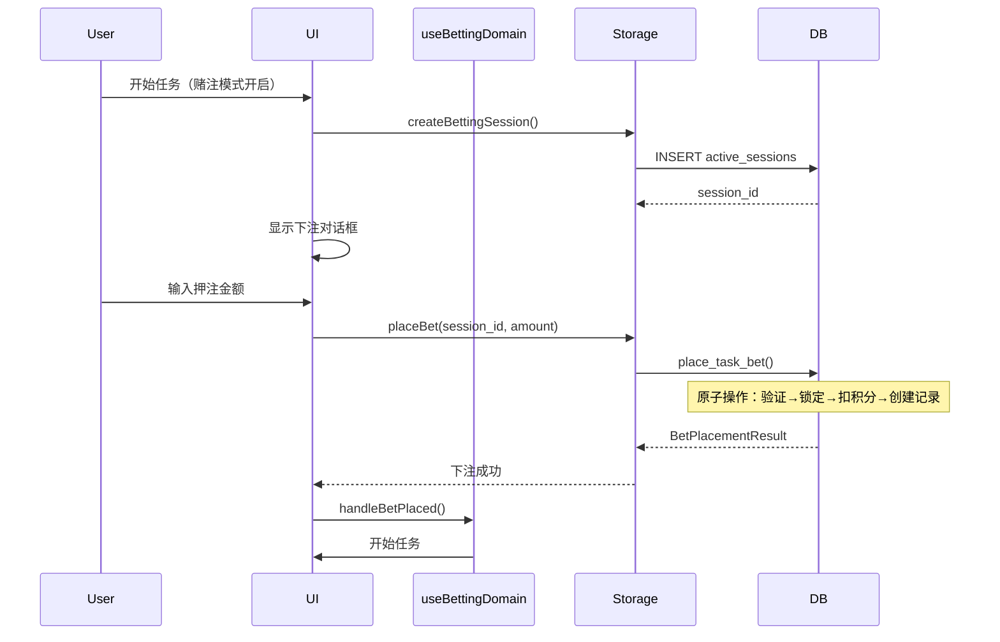
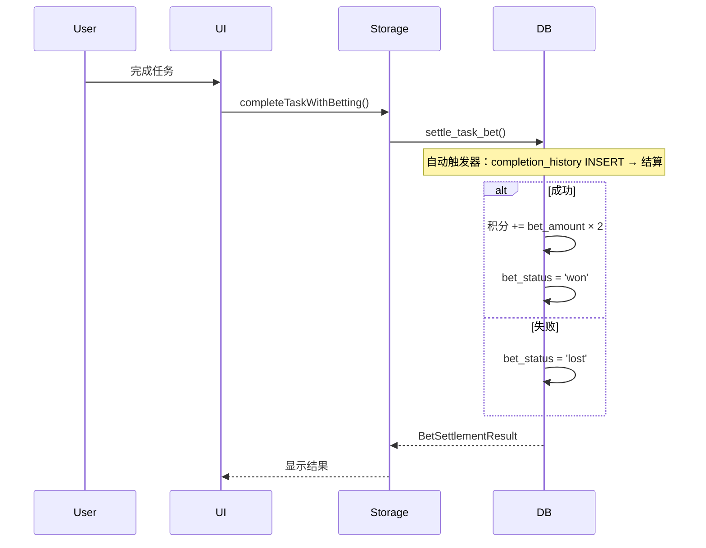

# Betting 领域文档

本文档描述 Momentum 的赌注/博彩模式系统，包括设计理念、数据模型、API 和常见操作。

---

## 概述

赌注模式是一个完整的积分投注系统，用户可以在任务开始时下注，成功完成获得双倍回报，失败则失去押注。

### 核心理念
- **1:1 赔率**：赢 = 获得 2 倍押注（净赚 1 倍）
- **单会话单注**：每个任务会话只能下一次注
- **自愿参与**：用户可自行开启/关闭赌注模式
- **自我限制**：支持每日限额和单注上限

---

## 关键文件

| 文件 | 职责 |
|------|------|
| `src/domain/betting.ts` | 类型定义 |
| `src/hooks/domains/useBettingDomain.ts` | 业务逻辑 Hook |
| `src/services/BettingService.ts` | 服务层 |
| `src/infra/storage/supabase/betting.ts` | Supabase 实现 |
| `src/domain/userSettings.ts` | 赌注模式设置 |

---

## 数据模型

### 核心类型

```typescript
// src/domain/betting.ts

interface BetPlacementRequest {
  session_id: string;
  bet_amount: number;
}

interface BetPlacementResult {
  success: boolean;
  message: string;
  bet_id?: string;
  bet_amount?: number;
  potential_payout?: number;   // 潜在收益
  points_before?: number;
  points_after?: number;
  error_code?: string;         // 错误码（见下方）
}

interface BettingHistoryEntry {
  id: string;
  session_id: string;
  chain_id: string;
  chain_name: string;
  bet_amount: number;
  bet_status: 'pending' | 'won' | 'lost' | 'cancelled' | 'refunded';
  potential_payout: number;
  actual_payout: number | null;
  created_at: string;
  settled_at: string | null;
}

interface GamblingStats {
  gambling_enabled: boolean;
  current_points: number;
  total_bets: number;
  total_wagered: number;
  net_profit: number;
  win_rate: number;
  biggest_win: number;
  biggest_loss: number;
  current_streak: number;
}
```

### 数据库表

#### user_settings
```sql
user_id: uuid PRIMARY KEY
gambling_mode_enabled: boolean DEFAULT false
daily_bet_limit: integer          -- 每日押注上限（可选）
max_single_bet: integer           -- 单注上限（可选）
settings_data: jsonb              -- 扩展配置
```

#### task_bets
```sql
id: uuid PRIMARY KEY
user_id: uuid
session_id: uuid UNIQUE           -- 每会话唯一
chain_id: uuid
bet_amount: integer CHECK (> 0)
bet_status: text                  -- pending/won/lost/cancelled/refunded
points_before: integer
points_after: integer
potential_payout: integer
actual_payout: integer            -- 结算后填充
settled_at: timestamptz
metadata: jsonb                   -- 审计日志
```

---

## 业务流程

### 下注流程



### 结算流程



---

## API 参考

### Storage 方法（MomentumStorage 接口）

| 方法 | 说明 | 仅 Supabase |
|------|------|:-----------:|
| `createBettingSession(chainId, duration)` | 创建押注会话 | ✓ |
| `deleteBettingSession(sessionId)` | 删除/取消会话 | ✓ |
| `placeBet(request)` | 下注 | ✓ |
| `completeTaskWithBetting(sessionId, success, notes)` | 结算 | ✓ |
| `getUserAvailablePoints()` | 获取可用积分 | ✓ |
| `getTodayBetAmount()` | 获取今日已押注金额 | ✓ |
| `getGamblingSettings()` | 获取赌注设置 | ✓ |
| `toggleGamblingMode()` | 开关赌注模式 | ✓ |
| `isGamblingModeEnabled()` | 检查是否启用 | ✓ |

### 数据库函数

| 函数 | 说明 |
|------|------|
| `place_task_bet(user_id, session_id, bet_amount)` | 原子下注操作 |
| `settle_task_bet(bet_id, task_successful, notes)` | 结算押注 |
| `get_user_gambling_stats(user_id)` | 获取统计数据 |
| `get_user_betting_history(user_id, page_size, offset)` | 分页历史 |

---

## 错误码

| 错误码 | 说明 | 处理建议 |
|--------|------|----------|
| `GAMBLING_DISABLED` | 用户未开启赌注模式 | 引导开启设置 |
| `INSUFFICIENT_POINTS` | 积分不足 | 显示当前余额 |
| `DUPLICATE_BET` | 该会话已下注 | 显示已有押注 |
| `SESSION_NOT_FOUND` | 会话不存在或无权限 | 刷新页面 |
| `BET_LIMIT_EXCEEDED` | 超过单注上限 | 显示上限值 |
| `DAILY_LIMIT_EXCEEDED` | 超过每日限额 | 显示剩余额度 |

---

## 安全机制

### 原子性保证
```sql
-- place_task_bet 核心逻辑
BEGIN
  -- 1. 行级锁定防并发
  SELECT points FROM user_points WHERE user_id = $1 FOR UPDATE;

  -- 2. 先创建押注记录
  INSERT INTO task_bets (...) VALUES (...);

  -- 3. 再扣除积分
  UPDATE user_points SET points = points - $3;

  -- 失败自动回滚
COMMIT;
```

### 防护措施
- **行级锁（FOR UPDATE）**：防止并发扣款
- **唯一约束（session_id）**：防止重复下注
- **RLS 策略**：用户只能操作自己的数据
- **审计日志（metadata）**：完整操作记录

---

## 常见操作场景

### 场景：用户开启赌注模式
```typescript
const result = await storage.toggleGamblingMode();
if (result.ok) {
  // 刷新设置状态
}
```

### 场景：用户取消下注
```typescript
// useBettingDomain.handleBetCancelled()
if (currentSessionId && storage.kind === 'supabase') {
  await storage.deleteBettingSession(currentSessionId);
  // 数据库触发器自动处理退款
}
```

### 场景：查询今日限额
```typescript
const [todaySpent, settings] = await Promise.all([
  storage.getTodayBetAmount(),
  storage.getGamblingSettings(),
]);

if (todaySpent.ok && settings.ok) {
  const remaining = settings.value.daily_bet_limit - todaySpent.value;
  // 显示剩余额度
}
```

---

## 性能优化

### 索引策略
```sql
-- 用户访问模式
CREATE INDEX idx_task_bets_user_created ON task_bets(user_id, created_at DESC);
CREATE INDEX idx_task_bets_user_status ON task_bets(user_id, bet_status);

-- 结算查询
CREATE INDEX idx_task_bets_session_id ON task_bets(session_id);

-- 稀疏索引
CREATE INDEX idx_user_settings_gambling_enabled
  ON user_settings(gambling_mode_enabled) WHERE gambling_mode_enabled = true;
```

---

## 运维指南

### 数据完整性检查
```sql
-- 检查孤立的押注记录
SELECT * FROM verify_bet_integrity();

-- 清理问题数据（需要管理员权限）
SELECT cleanup_bet_integrity_issues();
```

### 监控指标
- 每日押注量
- 押注成功率
- 平均押注金额
- 系统错误率

---

## 开放问题

| 问题 | 状态 | 备注 |
|------|------|------|
| 取消会话是否自动退款？ | ✅ 已实现 | 数据库触发器处理 |
| 是否支持取消待结算的押注？ | 待定 | 需求不明确 |
| 连胜奖励机制？ | 计划中 | v2.x 版本 |
| 最小押注金额？ | 当前 > 0 | 是否需要设置下限？ |

---

## 相关文档

- `docs/ARCHITECTURE.md` - 整体架构
- `docs/DATABASE_SCHEMA.md` - 数据库结构
- `DEBUGGING_GUIDE.md` - 调试指南
