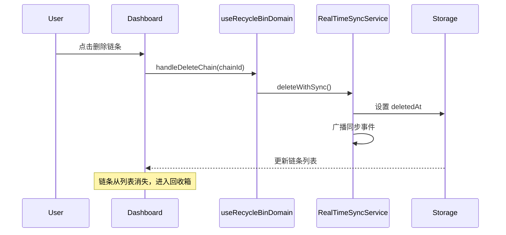
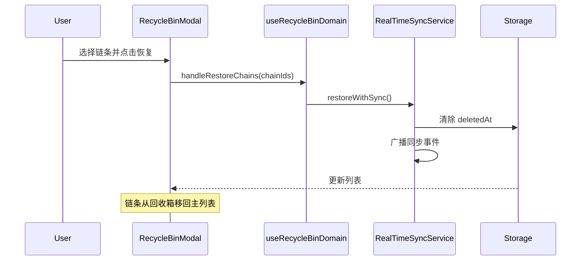
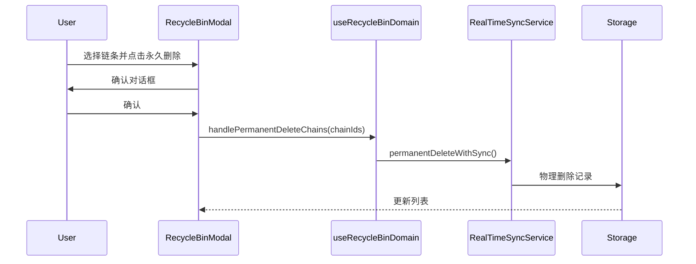

# Recycle Bin 领域文档

本文档描述 Momentum 的回收箱（软删除）功能，包括设计理念、数据模型和常见操作。

---

## 概述

回收箱功能提供软删除机制，允许用户恢复误删的链条，避免数据永久丢失。

### 核心特性
- **软删除**：删除的链条移入回收箱而非永久删除
- **恢复功能**：可随时恢复已删除的链条
- **永久删除**：支持从回收箱永久删除
- **多端同步**：通过 RealTimeSyncService 确保同步

---

## 关键文件

| 文件 | 职责 |
|------|------|
| `src/hooks/domains/useRecycleBinDomain.ts` | 回收箱业务逻辑 Hook |
| `src/services/RecycleBinService.ts` | 回收箱底层服务 |
| `src/services/RealTimeSyncService.ts` | 实时同步服务 |
| `src/components/RecycleBinModal.tsx` | 回收箱模态框组件 |

---

## 数据模型

### 软删除字段

链条表中的软删除相关字段：

```typescript
interface Chain {
  // ... 其他字段
  deletedAt?: Date;  // 软删除时间戳，null = 未删除
}
```

### 数据库

```sql
-- chains 表
deleted_at: timestamptz DEFAULT NULL

-- 索引
CREATE INDEX idx_chains_deleted_at ON chains(deleted_at);
CREATE INDEX idx_chains_user_deleted ON chains(user_id, deleted_at);
```

---

## 业务流程

### 软删除流程



### 恢复流程



### 永久删除流程



---

## API 参考

### useRecycleBinDomain Hook

| 方法 | 参数 | 说明 |
|------|------|------|
| `handleDeleteChain` | `(chainId: string)` | 软删除单个链条 |
| `handleRestoreChains` | `(chainIds: string[])` | 恢复多个链条 |
| `handlePermanentDeleteChains` | `(chainIds: string[])` | 永久删除多个链条 |

### Storage 方法

| 方法 | 说明 |
|------|------|
| `getActiveChains()` | 获取未删除的链条 |
| `getDeletedChains()` | 获取已删除的链条 |
| `softDeleteChain(chainId)` | 软删除链条 |
| `restoreChains(chainIds)` | 恢复链条 |
| `permanentDeleteChains(chainIds)` | 永久删除链条 |

---

## 删除时的关联处理

删除链条时，需要同时处理相关的会话数据：

```typescript
const handleDeleteChain = async (chainId: string) => {
  // 1. 软删除链条
  const updatedChains = await realTimeSyncService.deleteWithSync(storage, chainId);

  // 2. 清理相关预约会话
  const updatedScheduledSessions = state.scheduledSessions.filter(
    session => session.chainId !== chainId
  );

  // 3. 清理当前活动会话（如果是该链条）
  const updatedActiveSession = state.activeSession?.chainId === chainId
    ? null
    : state.activeSession;

  // 4. 持久化
  await storage.saveScheduledSessions(updatedScheduledSessions);
  if (!updatedActiveSession) {
    await storage.saveActiveSession(null);
  }

  // 5. 更新状态
  setState(prev => ({
    ...prev,
    chains: updatedChains,
    scheduledSessions: updatedScheduledSessions,
    activeSession: updatedActiveSession,
    currentView: updatedActiveSession ? prev.currentView : 'dashboard',
  }));
};
```

---

## 多端同步

### RealTimeSyncService 集成

```typescript
// 删除时同步
const updatedChains = await realTimeSyncService.deleteWithSync(storage, chainId);

// 恢复时同步
const updatedChains = await realTimeSyncService.restoreWithSync(storage, chainIds);

// 永久删除时同步
const updatedChains = await realTimeSyncService.permanentDeleteWithSync(storage, chainIds);
```

### 同步事件

当链条状态改变时，RealTimeSyncService 会广播事件，其他设备收到后更新本地状态。

---

## 错误处理

### 部分恢复失败

```typescript
try {
  await handleRestoreChains(chainIds);
} catch (error) {
  const rawMessage = error instanceof Error ? error.message : '';

  if (rawMessage.includes('Partial restore failure')) {
    // 重新加载数据
    const currentChains = await storage.getActiveChains();
    setState(prev => ({ ...prev, chains: currentChains }));

    toast.warning('部分链条恢复可能失败，请检查回收箱确认结果。');
    return;
  }

  toast.error('恢复失败，请重试');
}
```

### 删除失败回滚

```typescript
try {
  await handleDeleteChain(chainId);
} catch (error) {
  // 重新加载数据以恢复状态
  const currentChains = await storage.getActiveChains();
  setState(prev => ({ ...prev, chains: currentChains }));

  toast.error('删除失败，请重试');
}
```

---

## 使用场景

### 场景：查看回收箱

```typescript
// 获取已删除的链条
const deletedChains = chains.filter(c => c.deletedAt != null);

// 按删除时间排序
deletedChains.sort((a, b) =>
  new Date(b.deletedAt!).getTime() - new Date(a.deletedAt!).getTime()
);
```

### 场景：批量恢复

```typescript
const restoreSelected = async (selectedIds: string[]) => {
  try {
    await handleRestoreChains(selectedIds);
    toast.success(`已恢复 ${selectedIds.length} 个链条`);
  } catch (error) {
    toast.error('恢复失败');
  }
};
```

### 场景：清空回收箱

```typescript
const emptyRecycleBin = async () => {
  const deletedChains = chains.filter(c => c.deletedAt != null);
  const ids = deletedChains.map(c => c.id);

  if (confirm('确定要永久删除所有回收箱中的链条吗？此操作不可恢复。')) {
    await handlePermanentDeleteChains(ids);
    toast.success('回收箱已清空');
  }
};
```

---

## 相关文档

- `docs/ARCHITECTURE.md` - 整体架构
- `docs/DATABASE_SCHEMA.md` - 数据库结构
- `docs/DOMAIN_CHAINS.md` - 链条管理
