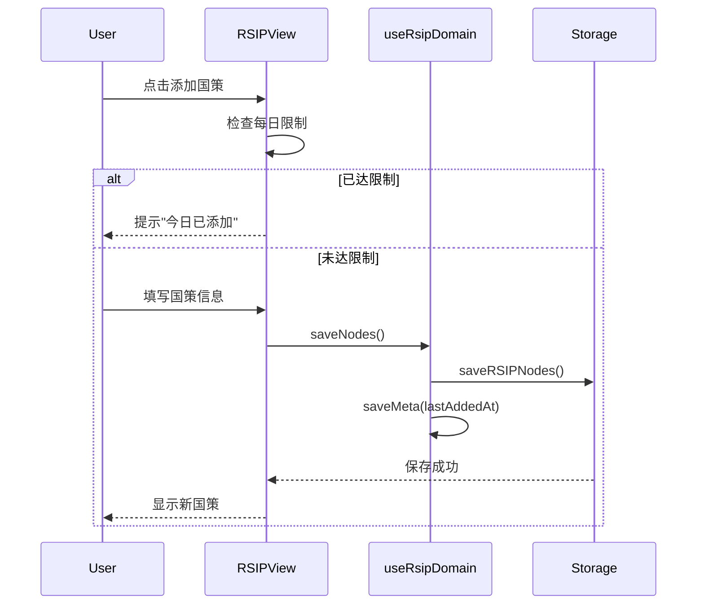
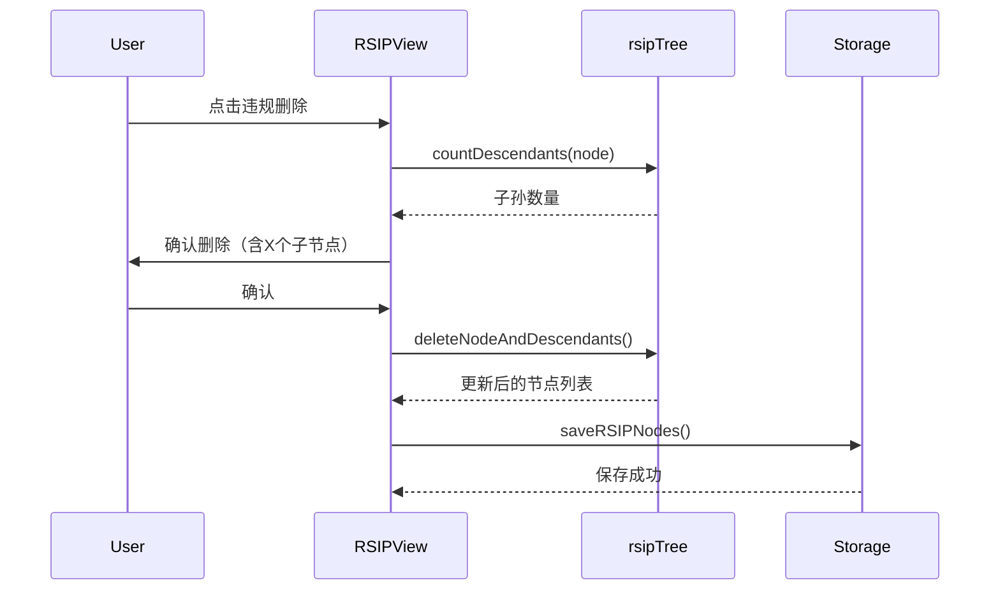

# RSIP 领域文档

本文档描述 Momentum 的 RSIP（递归稳态迭代协议）系统，包括设计理念、数据模型和常见操作。

---

## 概述

RSIP（Recursive Steady-state Iteration Protocol，递归稳态迭代协议）是一个个人规则管理系统，类似于"个人宪法"或"生活准则"。它帮助用户建立和维护长期习惯和行为规范。

### 核心理念
- **层级规则**：规则可以有父子关系，形成规则树
- **每日限制**：默认每天只能添加一条新规则，防止过度承诺
- **违规回滚**：违反规则时，该节点及其所有子节点将被删除
- **渐进式建立**：通过时间积累，逐步建立稳定的生活秩序

---

## 关键文件

| 文件 | 职责 |
|------|------|
| `src/types/index.ts` | RSIPNode, RSIPMeta, RSIPTreeNode 类型定义 |
| `src/hooks/domains/useRsipDomain.ts` | RSIP 业务逻辑 Hook |
| `src/utils/rsipTree.ts` | RSIP 树结构工具函数 |
| `src/infra/storage/supabase/rsip.ts` | Supabase 存储实现 |
| `src/components/RSIPView.tsx` | RSIP 视图组件 |

---

## 数据模型

### 核心类型

```typescript
// src/types/index.ts

interface RSIPNode {
  id: string;
  parentId?: string;      // 父节点ID
  title: string;          // 国策/定式名称
  rule: string;           // 精准、可执行的规则描述
  sortOrder: number;      // 排序（同一父节点下）
  createdAt: Date;        // 创建时间

  // 可选计时配置
  useTimer?: boolean;     // 是否使用计时
  timerMinutes?: number;  // 倒计时分钟数

  // UI 展示
  emoji?: string;         // 展示图标
  type?: string;          // 国策类型
}

interface RSIPTreeNode extends RSIPNode {
  children: RSIPTreeNode[];  // 子节点列表
  depth: number;             // 节点深度
}

interface RSIPMeta {
  lastAddedAt?: Date;           // 最近一次添加时间
  allowMultiplePerDay?: boolean; // 是否允许一天添加多条
}
```

### 数据库表

#### rsip_nodes
```sql
id: uuid PRIMARY KEY
user_id: uuid NOT NULL
parent_id: uuid             -- 父节点 ID
title: text NOT NULL        -- 国策名称
rule: text NOT NULL         -- 规则描述
sort_order: integer DEFAULT 0
use_timer: boolean DEFAULT false
timer_minutes: integer
emoji: text
type: text
created_at: timestamptz DEFAULT now()
```

#### rsip_meta
```sql
user_id: uuid PRIMARY KEY
last_added_at: timestamptz
allow_multiple_per_day: boolean DEFAULT false
```

---

## 树结构操作

### 构建树结构

```typescript
// src/utils/rsipTree.ts

/**
 * 将扁平的 RSIP 节点数组转换为树状结构
 */
export const buildRSIPTree = (nodes: RSIPNode[]): RSIPTreeNode[] => {
  // 1. 初始化节点 Map
  // 2. 建立父子关系
  // 3. 按 sortOrder 排序
  // 4. 返回根节点列表
};
```

### 计算子孙数量

```typescript
/**
 * 计算某节点的子孙数量（用于失败删除时的提示）
 */
export const countDescendants = (node: RSIPTreeNode): number => {
  let count = node.children.length;
  node.children.forEach(c => { count += countDescendants(c); });
  return count;
};
```

### 删除节点及子节点

```typescript
/**
 * 删除节点及其所有子节点，返回新数组
 */
export const deleteNodeAndDescendants = (nodes: RSIPNode[], nodeId: string): RSIPNode[] => {
  // 递归收集所有需要删除的 ID
  // 过滤并返回新数组
};
```

---

## 业务流程

### 添加国策流程



### 违规删除流程



---

## API 参考

### useRsipDomain Hook

| 方法 | 说明 |
|------|------|
| `openRSIP()` | 打开 RSIP 视图 |
| `saveNodes(nodes)` | 保存 RSIP 节点列表 |
| `saveMeta(meta)` | 保存 RSIP 元数据 |

### rsipTree 工具函数

| 函数 | 说明 |
|------|------|
| `buildRSIPTree(nodes)` | 构建树结构 |
| `countDescendants(node)` | 计算子孙数量 |
| `deleteNodeAndDescendants(nodes, nodeId)` | 删除节点及子节点 |

---

## 每日限制机制

### 检查逻辑

```typescript
const canAddToday = (meta: RSIPMeta): boolean => {
  // 如果允许多条，直接返回 true
  if (meta.allowMultiplePerDay) return true;

  // 检查是否同一天
  if (!meta.lastAddedAt) return true;

  const today = new Date();
  const lastAdded = new Date(meta.lastAddedAt);
  return today.toDateString() !== lastAdded.toDateString();
};
```

### 设计理由

- 防止用户一时冲动添加过多规则
- 强制用户深思熟虑每条规则
- 通过时间积累建立真正可执行的规则体系

---

## 使用场景

### 场景：创建根级国策

```typescript
const newNode: RSIPNode = {
  id: crypto.randomUUID(),
  parentId: undefined,  // 根级节点
  title: '早起',
  rule: '每天早上 7:00 前起床',
  sortOrder: 0,
  createdAt: new Date(),
  emoji: '🌅',
};

await saveNodes([...existingNodes, newNode]);
await saveMeta({ lastAddedAt: new Date() });
```

### 场景：创建子规则

```typescript
const childNode: RSIPNode = {
  id: crypto.randomUUID(),
  parentId: 'parent-node-id',  // 指定父节点
  title: '早起后晨练',
  rule: '早起后进行 15 分钟拉伸运动',
  sortOrder: 0,
  createdAt: new Date(),
  emoji: '🏃',
};

await saveNodes([...existingNodes, childNode]);
```

### 场景：违规删除

```typescript
// 用户违反了某条规则
const nodeToDelete = 'violated-node-id';

// 计算影响范围
const tree = buildRSIPTree(nodes);
const node = findNodeInTree(tree, nodeToDelete);
const descendantCount = countDescendants(node);

// 确认后删除
if (confirm(`此操作将删除该节点及其 ${descendantCount} 个子节点`)) {
  const updatedNodes = deleteNodeAndDescendants(nodes, nodeToDelete);
  await saveNodes(updatedNodes);
}
```

---

## 与其他系统的集成

### 与导入导出集成

RSIP 节点可以通过导入导出功能备份和迁移：

```typescript
// 导出
const exportData = {
  chains: [...],
  rsipNodes: await storage.getRSIPNodes(),
  rsipMeta: await storage.getRSIPMeta(),
};

// 导入
await handleImportChains(importedChains, {
  rsipNodes: importData.rsipNodes,
  rsipMeta: importData.rsipMeta,
});
```

---

## 相关文档

- `docs/ARCHITECTURE.md` - 整体架构
- `docs/DATABASE_SCHEMA.md` - 数据库结构
- `docs/DOMAIN_IMPORT_EXPORT.md` - 导入导出功能
