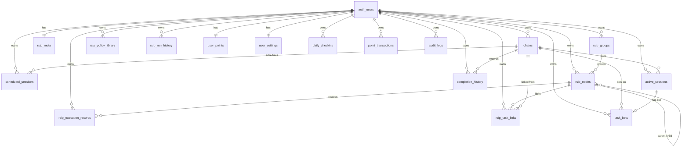

# Momentum 数据库 Schema 文档

本文档描述 Momentum 应用的 Supabase/PostgreSQL 数据库结构。

---

## 概览



---

## 核心表

### chains（任务链）

主要的任务/习惯定义表。

| 字段                           | 类型        | 约束                          | 说明                              |
| ------------------------------ | ----------- | ----------------------------- | --------------------------------- |
| `id`                           | uuid        | PK, DEFAULT gen_random_uuid() | 主键                              |
| `user_id`                      | uuid        | FK → auth.users, NOT NULL     | 所属用户                          |
| `parent_id`                    | uuid        | FK → chains(id)               | 父任务（任务群）                  |
| `type`                         | text        |                               | 任务类型（unit/group/assault...） |
| `name`                         | text        | NOT NULL                      | 任务名称                          |
| `trigger`                      | text        | NOT NULL                      | 神圣座位触发条件                  |
| `duration`                     | integer     | NOT NULL, DEFAULT 45          | 任务时长（分钟）                  |
| `description`                  | text        | NOT NULL                      | 任务描述                          |
| `current_streak`               | integer     | NOT NULL, DEFAULT 0           | 当前连胜                          |
| `auxiliary_streak`             | integer     | NOT NULL, DEFAULT 0           | 辅助链连胜                        |
| `total_completions`            | integer     | NOT NULL, DEFAULT 0           | 总完成次数                        |
| `total_failures`               | integer     | NOT NULL, DEFAULT 0           | 总失败次数                        |
| `auxiliary_failures`           | integer     | NOT NULL, DEFAULT 0           | 辅助链失败次数                    |
| `exceptions`                   | jsonb       | NOT NULL, DEFAULT '[]'        | 例外规则列表                      |
| `auxiliary_exceptions`         | jsonb       | NOT NULL, DEFAULT '[]'        | 辅助链例外规则                    |
| `auxiliary_signal`             | text        | NOT NULL                      | 预约信号                          |
| `auxiliary_duration`           | integer     | NOT NULL, DEFAULT 15          | 预约时长                          |
| `auxiliary_completion_trigger` | text        | NOT NULL                      | 辅助完成条件                      |
| `time_limit_hours`             | integer     |                               | 任务群时间限制                    |
| `group_started_at`             | timestamptz |                               | 任务群开始时间                    |
| `group_expires_at`             | timestamptz |                               | 任务群过期时间                    |
| `is_durationless`              | boolean     | DEFAULT false                 | 无时长任务标记                    |
| `minimum_duration`             | integer     |                               | 无时长任务最小时长                |
| `is_task_group`                | boolean     |                               | 是否为任务群                      |
| `task_repeat_count`            | integer     |                               | 任务重复次数                      |
| `group_repeat_count`           | integer     |                               | 任务群重复次数                    |
| `sort_order`                   | integer     | DEFAULT 0                     | 排序顺序                          |
| `deleted_at`                   | timestamptz | DEFAULT NULL                  | 软删除时间戳                      |
| `created_at`                   | timestamptz | DEFAULT now()                 | 创建时间                          |
| `last_completed_at`            | timestamptz |                               | 最后完成时间                      |

**索引**：

- `idx_chains_user_id` (user_id)
- `idx_chains_created_at` (created_at DESC)
- `idx_chains_deleted_at` (deleted_at)
- `idx_chains_user_deleted` (user_id, deleted_at)

---

### active_sessions（活动会话）

当前正在进行的任务会话。

| 字段                   | 类型        | 约束                      | 说明                   |
| ---------------------- | ----------- | ------------------------- | ---------------------- |
| `id`                   | uuid        | PK                        | 主键                   |
| `user_id`              | uuid        | FK → auth.users, NOT NULL | 所属用户               |
| `chain_id`             | uuid        | FK → chains(id), NOT NULL | 关联任务               |
| `started_at`           | timestamptz | NOT NULL, DEFAULT now()   | 开始时间               |
| `duration`             | integer     | NOT NULL                  | 会话时长（分钟）       |
| `is_paused`            | boolean     | NOT NULL, DEFAULT false   | 是否暂停               |
| `paused_at`            | timestamptz |                           | 暂停时间               |
| `total_paused_time`    | integer     | NOT NULL, DEFAULT 0       | 总暂停时长（毫秒）     |
| `is_forward_timer`     | boolean     |                           | 是否正向计时           |
| `forward_elapsed_time` | integer     |                           | 正向计时已用时间（秒） |

**索引**：

- `idx_active_sessions_user_id` (user_id)

---

### scheduled_sessions（预约会话）

已预约但尚未开始的任务。

| 字段               | 类型        | 约束                      | 说明     |
| ------------------ | ----------- | ------------------------- | -------- |
| `id`               | uuid        | PK                        | 主键     |
| `user_id`          | uuid        | FK → auth.users, NOT NULL | 所属用户 |
| `chain_id`         | uuid        | FK → chains(id), NOT NULL | 关联任务 |
| `scheduled_at`     | timestamptz | NOT NULL, DEFAULT now()   | 预约时间 |
| `expires_at`       | timestamptz | NOT NULL                  | 过期时间 |
| `auxiliary_signal` | text        | NOT NULL                  | 预约信号 |

**索引**：

- `idx_scheduled_sessions_user_id` (user_id)
- `idx_scheduled_sessions_expires_at` (expires_at)
- `idx_scheduled_sessions_user_chain_unique` (user_id, chain_id) UNIQUE

---

### completion_history（完成历史）

任务完成/失败的历史记录。

| 字段                 | 类型        | 约束                      | 说明             |
| -------------------- | ----------- | ------------------------- | ---------------- |
| `id`                 | uuid        | PK                        | 主键             |
| `user_id`            | uuid        | FK → auth.users, NOT NULL | 所属用户         |
| `chain_id`           | uuid        | FK → chains(id), NOT NULL | 关联任务         |
| `completed_at`       | timestamptz | NOT NULL, DEFAULT now()   | 完成时间         |
| `duration`           | integer     | NOT NULL                  | 计划时长（分钟） |
| `was_successful`     | boolean     | NOT NULL                  | 是否成功         |
| `reason_for_failure` | text        |                           | 失败原因         |
| `actual_duration`    | integer     |                           | 实际用时（分钟） |
| `is_forward_timed`   | boolean     |                           | 是否正向计时     |
| `description`        | text        |                           | 完成描述         |
| `notes`              | text        |                           | 备注             |

**索引**：

- `idx_completion_history_user_id` (user_id)
- `idx_completion_history_chain_id` (chain_id)
- `idx_completion_history_completed_at` (completed_at DESC)
- `idx_completion_history_user_chain_completed_unique` (user_id, chain_id, completed_at) UNIQUE

---

## RSIP 表

### rsip_nodes（RSIP 节点）

递归稳态迭代协议的规则节点。

| 字段                         | 类型        | 约束                                      | 说明                          |
| ---------------------------- | ----------- | ----------------------------------------- | ----------------------------- |
| `id`                         | uuid        | PK                                        | 主键                          |
| `user_id`                    | uuid        | FK → auth.users, NOT NULL                 | 所属用户                      |
| `parent_id`                  | uuid        | FK → rsip_nodes(id)                       | 父节点                        |
| `group_id`                   | uuid        | FK → rsip_groups(id), ON DELETE SET NULL  | 所属国策组                    |
| `title`                      | text        | NOT NULL                                  | 国策/定式名称                 |
| `rule`                       | text        | NOT NULL                                  | 规则描述                      |
| `sort_order`                 | integer     | NOT NULL, DEFAULT 0                       | 排序                          |
| `use_timer`                  | boolean     | NOT NULL, DEFAULT false                   | 是否使用计时                  |
| `timer_minutes`              | integer     |                                           | 计时分钟数                    |
| `emoji`                      | text        |                                           | 展示图标                      |
| `type`                       | text        |                                           | 国策类型                      |
| `reinforcement_level`        | integer     | NOT NULL, DEFAULT 0                       | 当前强化等级                  |
| `max_reinforcement_level`    | integer     | NOT NULL, DEFAULT 0                       | 历史最高强化等级              |
| `cumulative_execution_days`  | integer     | NOT NULL, DEFAULT 0                       | 累积执行天数                  |
| `is_passive`                 | boolean     | NOT NULL, DEFAULT false                   | 是否为被动型规则              |
| `split_from_goal`            | text        |                                           | 该节点拆分自的上层目标        |
| `stability_phase`            | text        | DEFAULT 'E0', CHECK IN ('E0','E1','E2')   | 稳态阶段                      |
| `phase_started_at`           | timestamptz |                                           | 当前阶段开始时间              |
| `last_executed_at`           | timestamptz |                                           | 最近执行时间                  |
| `last_violated_at`           | timestamptz |                                           | 最近违规时间                  |
| `consecutive_executions`     | integer     | DEFAULT 0                                 | 连续执行次数                  |
| `consecutive_violations`     | integer     | DEFAULT 0                                 | 连续违规次数                  |
| `total_executions`           | integer     | DEFAULT 0                                 | 总执行次数                    |
| `total_violations`           | integer     | DEFAULT 0                                 | 总违规次数                    |
| `created_at`                 | timestamptz | NOT NULL, DEFAULT now()                   | 创建时间                      |

**索引**：

- `idx_rsip_nodes_user` (user_id)
- `idx_rsip_nodes_parent` (parent_id)
- `idx_rsip_nodes_sort` (sort_order)
- `idx_rsip_nodes_group_id` (group_id)
- `idx_rsip_nodes_reinforcement` (reinforcement_level)
- `idx_rsip_nodes_is_passive` (is_passive)
- `idx_rsip_nodes_stability_phase` (stability_phase)
- `idx_rsip_nodes_last_executed` (last_executed_at DESC)

### rsip_meta（RSIP 元数据）

每用户一条的 RSIP 配置。

| 字段                       | 类型        | 约束                    | 说明                 |
| -------------------------- | ----------- | ----------------------- | -------------------- |
| `user_id`                  | uuid        | PK, FK → auth.users     | 用户 ID              |
| `last_added_at`            | timestamptz |                         | 最近添加时间         |
| `allow_multiple_per_day`   | boolean     | NOT NULL, DEFAULT false | 允许每日多条         |
| `last_tree_opened_at`      | timestamptz |                         | 最近打开 RSIP 树时间 |
| `daily_tree_open_required` | boolean     | DEFAULT false           | 是否要求每日先开树   |
| `tree_open_streak`         | integer     | DEFAULT 0               | 连续开树天数         |
| `current_run_number`       | integer     |                         | 当前运行轮次         |
| `current_run_started_at`   | timestamptz |                         | 当前轮开始时间       |

---

### rsip_groups（RSIP 国策组）

规则节点的逻辑分组，用于容错和批量管理。

| 字段               | 类型        | 约束                            | 说明         |
| ------------------ | ----------- | ------------------------------- | ------------ |
| `id`               | uuid        | PK, DEFAULT gen_random_uuid()   | 主键         |
| `user_id`          | uuid        | FK → auth.users, NOT NULL       | 所属用户     |
| `title`            | text        | NOT NULL                        | 组名称       |
| `fault_tolerance`  | integer     | NOT NULL, DEFAULT 0, CHECK >= 0 | 容错值       |
| `emoji`            | text        |                                 | 组图标       |
| `created_at`       | timestamptz | NOT NULL, DEFAULT now()         | 创建时间     |
| `updated_at`       | timestamptz | NOT NULL, DEFAULT now()         | 更新时间     |

**索引**：

- `idx_rsip_groups_user` (user_id)
- `idx_rsip_groups_created` (user_id, created_at DESC)

### rsip_policy_library（RSIP 策略库）

已归档的规则模板库，用于复用成熟策略。

| 字段                         | 类型         | 约束                            | 说明             |
| ---------------------------- | ------------ | ------------------------------- | ---------------- |
| `user_id`                    | uuid         | PK(part), FK → auth.users       | 用户 ID          |
| `id`                         | uuid         | PK(part)                        | 策略 ID          |
| `title`                      | text         | NOT NULL                        | 标题             |
| `rule`                       | text         | NOT NULL                        | 规则内容         |
| `type`                       | text         |                                 | 策略类型         |
| `emoji`                      | text         |                                 | 展示图标         |
| `cumulative_execution_days`  | integer      | NOT NULL, DEFAULT 0             | 累积执行天数     |
| `internalization_progress`   | numeric(5,2) | NOT NULL, DEFAULT 0, CHECK 0-100| 内化进度         |
| `last_active_at`             | timestamptz  | NOT NULL, DEFAULT now()         | 最近活跃时间     |
| `times_used`                 | integer      | NOT NULL, DEFAULT 0             | 复用次数         |
| `use_timer`                  | boolean      | NOT NULL, DEFAULT false         | 是否启用计时     |
| `timer_minutes`              | integer      |                                 | 计时分钟数       |
| `is_passive`                 | boolean      | NOT NULL, DEFAULT false         | 是否被动型       |
| `updated_at`                 | timestamptz  | NOT NULL, DEFAULT now()         | 更新时间         |

**索引**：

- `idx_rsip_policy_library_user_updated` (user_id, updated_at DESC)

### rsip_run_history（RSIP 运行历史）

记录每一轮 RSIP 运行的起止和塌缩上下文。

| 字段                  | 类型        | 约束                        | 说明               |
| --------------------- | ----------- | --------------------------- | ------------------ |
| `user_id`             | uuid        | PK(part), FK → auth.users   | 用户 ID            |
| `run_number`          | integer     | PK(part), CHECK > 0         | 运行轮次           |
| `started_at`          | timestamptz | NOT NULL                    | 开始时间           |
| `ended_at`            | timestamptz |                             | 结束时间           |
| `max_node_count`      | integer     | NOT NULL, DEFAULT 0         | 轮次内最大节点数   |
| `duration_days`       | integer     | NOT NULL, DEFAULT 0         | 持续天数           |
| `collapse_reason`     | text        |                             | 塌缩原因           |
| `collapse_node_title` | text        |                             | 触发塌缩的节点标题 |
| `updated_at`          | timestamptz | NOT NULL, DEFAULT now()     | 更新时间           |

**索引**：

- `idx_rsip_run_history_user` (user_id, run_number DESC)

### rsip_execution_records（RSIP 执行记录）

记录节点执行、违规和修复上下文。

| 字段              | 类型        | 约束                                                       | 说明             |
| ----------------- | ----------- | ---------------------------------------------------------- | ---------------- |
| `id`              | uuid        | PK, DEFAULT gen_random_uuid()                              | 主键             |
| `user_id`         | uuid        | FK → auth.users, NOT NULL                                  | 所属用户         |
| `node_id`         | uuid        | FK → rsip_nodes(id), NOT NULL                              | 关联 RSIP 节点   |
| `executed_at`     | timestamptz | NOT NULL, DEFAULT now()                                    | 事件时间         |
| `status`          | text        | NOT NULL, CHECK IN ('pending','executed','violated','skipped') | 事件状态     |
| `notes`           | text        |                                                            | 备注             |
| `reason_code`     | text        |                                                            | 原因代码         |
| `repair_hint`     | text        |                                                            | 修复建议         |
| `source_chain_id` | uuid        | FK → chains(id)                                            | 来源任务链       |
| `source_event`    | text        |                                                            | 来源事件         |
| `created_at`      | timestamptz | NOT NULL, DEFAULT now()                                    | 创建时间         |

**索引**：

- `idx_rsip_execution_records_user` (user_id)
- `idx_rsip_execution_records_node` (node_id)
- `idx_rsip_execution_records_date` (executed_at DESC)
- `idx_rsip_execution_records_status` (status)

### rsip_task_links（RSIP 任务联动）

定义 RSIP 节点和普通任务链之间的触发与联动效果。

| 字段            | 类型        | 约束                                                                                     | 说明         |
| --------------- | ----------- | ---------------------------------------------------------------------------------------- | ------------ |
| `id`            | uuid        | PK, DEFAULT gen_random_uuid()                                                            | 主键         |
| `user_id`       | uuid        | FK → auth.users, NOT NULL                                                                | 所属用户     |
| `rsip_node_id`  | uuid        | FK → rsip_nodes(id), NOT NULL                                                            | RSIP 节点    |
| `chain_id`      | uuid        | FK → chains(id), NOT NULL                                                                | 关联任务链   |
| `chain_kind`    | text        | NOT NULL, CHECK IN ('group','unit')                                                      | 任务链类型   |
| `trigger_event` | text        | NOT NULL, CHECK IN ('task_completed','task_interrupted','group_cycle_completed','rsip_mark_executed') | 触发事件 |
| `effect`        | text        | NOT NULL, CHECK IN ('mark_rsip_executed','mark_rsip_violated','prompt_start_chain','prompt_schedule_chain') | 联动效果 |
| `automation`    | text        | NOT NULL, DEFAULT 'confirm', CHECK IN ('auto','confirm')                                 | 自动化策略   |
| `is_active`     | boolean     | NOT NULL, DEFAULT true                                                                   | 是否启用     |
| `updated_at`    | timestamptz | NOT NULL, DEFAULT now()                                                                  | 更新时间     |

**索引 / 约束**：

- `uq_rsip_task_links_key` (user_id, rsip_node_id, chain_id, trigger_event, effect) UNIQUE
- `idx_rsip_task_links_user` (user_id, updated_at DESC)

---

## 积分系统表

### user_points（用户积分）

用户总积分，单一真相来源。

| 字段           | 类型        | 约束                            | 说明     |
| -------------- | ----------- | ------------------------------- | -------- |
| `user_id`      | uuid        | PK, FK → auth.users             | 用户 ID  |
| `total_points` | integer     | NOT NULL, DEFAULT 0, CHECK >= 0 | 总积分   |
| `created_at`   | timestamptz | NOT NULL, DEFAULT now()         | 创建时间 |
| `updated_at`   | timestamptz | NOT NULL, DEFAULT now()         | 更新时间 |

### daily_checkins（每日签到）

签到记录。

| 字段               | 类型        | 约束                            | 说明     |
| ------------------ | ----------- | ------------------------------- | -------- |
| `id`               | uuid        | PK                              | 主键     |
| `user_id`          | uuid        | FK → auth.users, NOT NULL       | 所属用户 |
| `checkin_date`     | date        | NOT NULL, DEFAULT CURRENT_DATE  | 签到日期 |
| `points_earned`    | integer     | NOT NULL, DEFAULT 10, CHECK > 0 | 获得积分 |
| `consecutive_days` | integer     | NOT NULL, DEFAULT 1, CHECK > 0  | 连续天数 |
| `created_at`       | timestamptz | NOT NULL, DEFAULT now()         | 创建时间 |

**约束**：`UNIQUE(user_id, checkin_date)` - 每用户每天仅一条

**索引**：

- `idx_daily_checkins_user_id` (user_id)
- `idx_daily_checkins_user_date` (user_id, checkin_date DESC)
- `idx_daily_checkins_date` (checkin_date DESC)

### point_transactions（积分流水）

所有积分变动的审计日志。

| 字段               | 类型        | 约束                      | 说明             |
| ------------------ | ----------- | ------------------------- | ---------------- |
| `id`               | uuid        | PK                        | 主键             |
| `user_id`          | uuid        | FK → auth.users, NOT NULL | 所属用户         |
| `transaction_type` | text        | NOT NULL                  | 交易类型（见下） |
| `points_change`    | integer     | NOT NULL, CHECK != 0      | 变动数量         |
| `points_before`    | integer     | NOT NULL, CHECK >= 0      | 变动前积分       |
| `points_after`     | integer     | NOT NULL, CHECK >= 0      | 变动后积分       |
| `description`      | text        |                           | 描述             |
| `reference_id`     | uuid        |                           | 关联 ID          |
| `created_at`       | timestamptz | NOT NULL, DEFAULT now()   | 创建时间         |

**交易类型**：

- `checkin` - 签到奖励
- `bonus` - 额外奖励
- `deduction` - 扣除
- `refund` - 退款
- `bet_placed` - 下注
- `bet_won` - 赢得
- `bet_lost` - 失去
- `bet_refunded` - 押注退款

---

## 赌注系统表

### user_settings（用户设置）

用户偏好设置，包括赌注模式。

| 字段                    | 类型        | 约束                    | 说明         |
| ----------------------- | ----------- | ----------------------- | ------------ |
| `user_id`               | uuid        | PK, FK → auth.users     | 用户 ID      |
| `gambling_mode_enabled` | boolean     | NOT NULL, DEFAULT false | 赌注模式开关 |
| `daily_bet_limit`       | integer     | CHECK >= 0              | 每日押注上限 |
| `max_single_bet`        | integer     | CHECK >= 0              | 单注上限     |
| `settings_data`         | jsonb       | NOT NULL, DEFAULT '{}'  | 扩展设置     |
| `created_at`            | timestamptz | NOT NULL, DEFAULT now() | 创建时间     |
| `updated_at`            | timestamptz | NOT NULL, DEFAULT now() | 更新时间     |

### task_bets（任务押注）

押注记录。

| 字段                  | 类型        | 约束                               | 说明         |
| --------------------- | ----------- | ---------------------------------- | ------------ |
| `id`                  | uuid        | PK                                 | 主键         |
| `user_id`             | uuid        | FK → auth.users, NOT NULL          | 所属用户     |
| `session_id`          | uuid        | FK → active_sessions(id), NOT NULL | 关联会话     |
| `chain_id`            | uuid        | FK → chains(id), NOT NULL          | 关联任务     |
| `bet_amount`          | integer     | NOT NULL, CHECK > 0                | 押注金额     |
| `bet_status`          | text        | NOT NULL, DEFAULT 'pending'        | 状态（见下） |
| `points_before`       | integer     | NOT NULL, CHECK >= 0               | 押注前积分   |
| `points_after`        | integer     | CHECK >= 0                         | 结算后积分   |
| `potential_payout`    | integer     | NOT NULL, CHECK > 0                | 潜在收益     |
| `actual_payout`       | integer     | CHECK >= 0                         | 实际收益     |
| `settled_at`          | timestamptz |                                    | 结算时间     |
| `cancellation_reason` | text        |                                    | 取消原因     |
| `metadata`            | jsonb       | NOT NULL, DEFAULT '{}'             | 审计元数据   |
| `created_at`          | timestamptz | NOT NULL, DEFAULT now()            | 创建时间     |

**押注状态**：

- `pending` - 待结算
- `won` - 赢得
- `lost` - 失去
- `cancelled` - 已取消
- `refunded` - 已退款

**约束**：`UNIQUE(user_id, session_id)` - 每会话仅一注

**索引**：

- `idx_task_bets_user_id` (user_id)
- `idx_task_bets_session_id` (session_id)
- `idx_task_bets_chain_id` (chain_id)
- `idx_task_bets_status` (bet_status)
- `idx_task_bets_user_created` (user_id, created_at DESC)
- `idx_task_bets_user_status` (user_id, bet_status)
- `idx_task_bets_settled_at` (settled_at DESC) WHERE settled_at IS NOT NULL

### audit_logs（审计日志）

敏感操作审计。

| 字段         | 类型        | 约束            | 说明     |
| ------------ | ----------- | --------------- | -------- |
| `id`         | uuid        | PK              | 主键     |
| `user_id`    | uuid        | FK → auth.users | 用户 ID  |
| `action`     | text        | NOT NULL        | 操作类型 |
| `details`    | jsonb       | DEFAULT '{}'    | 详情     |
| `ip_address` | inet        |                 | IP 地址  |
| `user_agent` | text        |                 | 用户代理 |
| `created_at` | timestamptz | DEFAULT now()   | 创建时间 |

---

## RLS（行级安全）策略

所有表都启用了 RLS，确保用户只能访问自己的数据。

### 通用策略模式

```sql
-- 用户只能操作自己的数据
CREATE POLICY "Users can manage their own [table]"
  ON [table]
  FOR ALL
  TO authenticated
  USING (auth.uid() = user_id)
  WITH CHECK (auth.uid() = user_id);
```

### 特殊策略

| 表           | 策略             | 说明                      |
| ------------ | ---------------- | ------------------------- |
| `task_bets`  | 仅 SELECT/INSERT | 更新通过数据库函数处理    |
| `audit_logs` | 仅 SELECT        | 用户只读，系统写入        |
| `chains`     | 包含软删除       | 用户可查看/恢复已删除链条 |

---

## 数据库函数

### 签到系统

| 函数                       | 参数                       | 返回  | 说明         |
| -------------------------- | -------------------------- | ----- | ------------ |
| `perform_daily_checkin`    | user_id uuid               | jsonb | 原子签到操作 |
| `get_user_checkin_stats`   | user_id uuid               | jsonb | 获取签到统计 |
| `get_user_checkin_history` | user_id, page_size, offset | jsonb | 分页签到历史 |

### 赌注系统

| 函数                       | 参数                            | 返回  | 说明         |
| -------------------------- | ------------------------------- | ----- | ------------ |
| `place_task_bet`           | user_id, session_id, bet_amount | jsonb | 原子下注     |
| `settle_task_bet`          | bet_id, task_successful, notes  | jsonb | 结算押注     |
| `get_user_gambling_stats`  | user_id                         | jsonb | 赌博统计     |
| `get_user_betting_history` | user_id, page_size, offset      | jsonb | 分页押注历史 |

---

## 迁移历史

| 迁移文件                                                | 日期       | 说明                                   |
| ------------------------------------------------------- | ---------- | -------------------------------------- |
| `20250122000000_performance_optimization_v2.sql`        | 2025-01-22 | 旧版性能优化脚本（仓库中保留）          |
| `20250730021823_winter_flame.sql`                       | 2025-07-30 | 初始 schema：chains, sessions, history |
| `20250801160754_peaceful_palace.sql`                    | 2025-08-01 | 添加 parent_id, type, sort_order       |
| `20250808000000_add_group_time_limit.sql`               | 2025-08-08 | 任务群时间限制                         |
| `20250808001000_add_durationless_flag.sql`              | 2025-08-08 | 无时长任务支持                         |
| `20250810000000_add_rsip_tables.sql`                    | 2025-08-10 | RSIP 系统                              |
| `20250814000000_add_soft_delete.sql`                    | 2025-08-14 | 软删除/回收箱                          |
| `20250817000000_add_completion_description_notes.sql`   | 2025-08-17 | 完成描述和备注                         |
| `20250817100000_add_timing_fields.sql`                  | 2025-08-17 | 正向计时字段                           |
| `20250801161456_fading_sunset.sql`                      | 2025-08-01 | parent/type/sort_order 兼容性补丁      |
| `20250817103715_add_completion_description_notes.sql`   | 2025-08-17 | description/notes 幂等补丁             |
| `20250817110614_add_timing_fields.sql`                  | 2025-08-17 | timing 字段幂等补丁                    |
| `20250820000000_performance_optimization.sql`           | 2025-08-20 | 性能优化索引                           |
| `20250904000000_add_daily_checkin_system.sql`           | 2025-09-04 | 签到积分系统                           |
| `20250905000000_add_gambling_mode_system.sql`           | 2025-09-05 | 赌注系统                               |
| `20250905100000_fix_bet_transaction_atomicity.sql`      | 2025-09-05 | 押注事务修复                           |
| `20250906000000_implement_universal_write_sessions.sql` | 2025-09-06 | 通用写入会话                           |
| `20250906000001_fix_function_conflicts.sql`             | 2025-09-06 | 函数命名/冲突修复                      |
| `20250906000002_fix_bet_settlement_on_session_completion.sql` | 2025-09-06 | 会话完成时的赌注结算修复         |
| `20250906000003_fix_betting_reward_calculation.sql`     | 2025-09-06 | 赌注奖励计算修复                      |
| `20250906000004_fix_function_overloading_conflict.sql`  | 2025-09-06 | RPC 重载冲突修复                      |
| `20250906000005_complete_function_conflict_fix.sql`     | 2025-09-06 | 函数冲突修复收尾                      |
| `20250906000006_fix_create_write_session_type_mismatch.sql` | 2025-09-06 | 写入会话类型不匹配修复          |
| `20260114000000_add_chain_repeat_and_minimum_duration.sql` | 2026-01-14 | 任务重复次数与最小时长字段       |
| `20260123000000_optimize_rls_policy_auth_uid.sql`       | 2026-01-23 | RLS 性能与安全增强                     |
| `20260124000000_rsip_execution_tracking.sql`            | 2026-01-24 | RSIP 稳态阶段与执行追踪字段            |
| `20260127000000_dedupe_and_add_unique_indexes.sql`      | 2026-01-27 | scheduled/completion 去重与唯一索引    |
| `20260208000000_rsip_process_integration.sql`           | 2026-02-08 | RSIP 分组、策略库、运行历史、任务联动  |
| `20260211000000_schema_alignment_hotfix.sql`            | 2026-02-11 | schema 对齐热修复                      |
| `20260223000000_migrate_points_columns_to_bigint.sql`   | 2026-02-23 | 积分字段迁移到 bigint                  |
| `20260225000000_fix_settle_task_bet_loss_noop_transaction.sql` | 2026-02-25 | 修复输掉赌注的 0 分事务问题     |

---

## 常用查询示例

### 获取活动链条（排除已删除）

```sql
SELECT * FROM chains
WHERE user_id = auth.uid()
  AND deleted_at IS NULL
ORDER BY sort_order, created_at;
```

### 获取回收箱链条

```sql
SELECT * FROM chains
WHERE user_id = auth.uid()
  AND deleted_at IS NOT NULL
ORDER BY deleted_at DESC;
```

### 获取今日签到状态

```sql
SELECT EXISTS (
  SELECT 1 FROM daily_checkins
  WHERE user_id = auth.uid()
    AND checkin_date = CURRENT_DATE
) AS has_checked_in_today;
```

### 获取用户可用积分

```sql
SELECT total_points FROM user_points
WHERE user_id = auth.uid();
```

---

## 相关文档

- `docs/guides/ARCHITECTURE.md` - 整体架构
- `docs/features/DOMAIN_BETTING.md` - 赌注系统
- `docs/features/DOMAIN_RULES.md` - 例外规则
- `docs/guides/apply-migration.md` - 迁移指南
