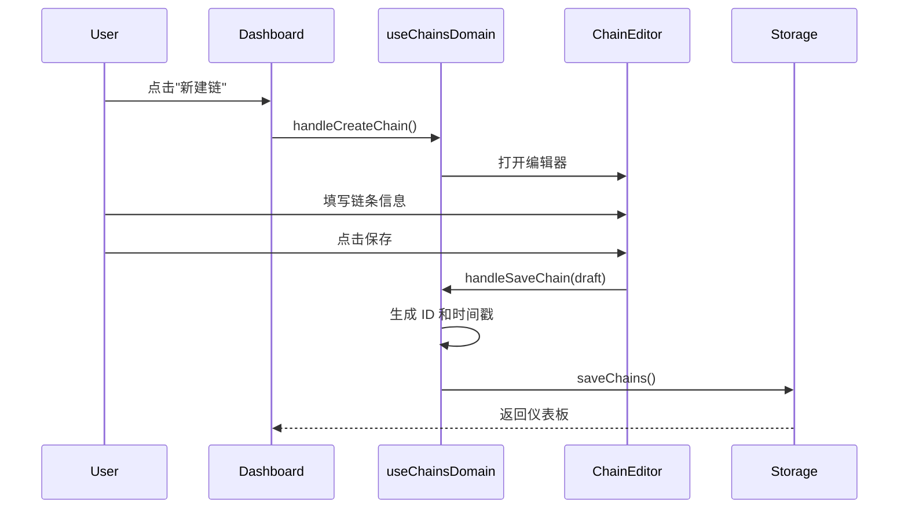
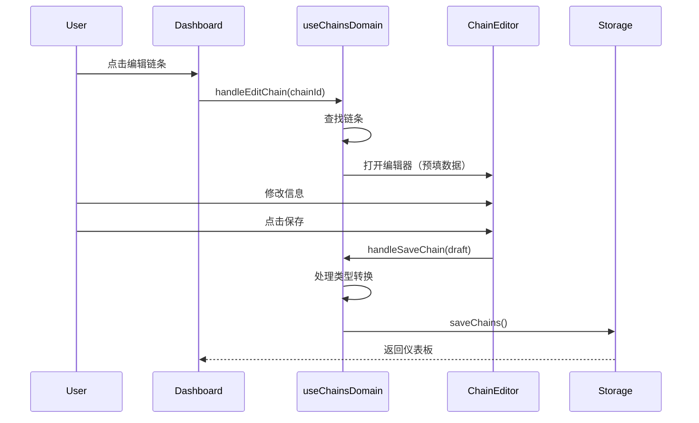

# Chains 领域文档

本文档描述 Momentum 的任务链 CRUD 操作，包括创建、编辑、保存和类型处理。

---

## 概述

任务链（Chain）是 Momentum 的核心数据结构，代表一个需要培养的习惯或任务。链条系统支持多种类型，包括普通单元链和任务组。

### 核心特性
- **类型区分**：UnitChain（单元链）和 GroupChain（任务组）
- **层级结构**：支持父子关系（parentId）
- **类型转换**：编辑时可在类型间转换
- **复制功能**：支持复制链条

---

## 关键文件

| 文件 | 职责 |
|------|------|
| `src/types/index.ts` | Chain, UnitChain, GroupChain, ChainDraft 类型定义 |
| `src/hooks/domains/useChainsDomain.ts` | 链条 CRUD 业务逻辑 Hook |
| `src/hooks/domains/useSafeSaveChains.ts` | 安全保存工具 Hook |
| `src/components/chain-editor/` | 链条编辑器组件 |
| `src/components/TaskGroupEditor.tsx` | 任务组编辑器组件 |

---

## 数据模型

### 核心类型

```typescript
// 基础链条记录
interface ChainRecord {
  id: string;
  name: string;
  trigger: string;              // 神圣座位触发条件
  duration: number;             // 任务时长（分钟）
  description: string;
  currentStreak: number;        // 当前连胜
  auxiliaryStreak: number;      // 辅助链连胜
  totalCompletions: number;     // 总完成次数
  totalFailures: number;        // 总失败次数
  auxiliaryFailures: number;    // 辅助链失败次数
  exceptions: string[];         // 例外规则
  auxiliaryExceptions: string[];
  auxiliarySignal: string;      // 预约信号
  auxiliaryDuration: number;    // 预约时长
  auxiliaryCompletionTrigger: string;
  createdAt: Date;
  lastCompletedAt?: Date;
  parentId?: string;            // 父任务组 ID
  sortOrder?: number;           // 排序
  deletedAt?: Date;             // 软删除时间戳

  // 任务组相关
  timeLimitHours?: number;
  groupStartedAt?: Date;
  groupExpiresAt?: Date;
  isTaskGroup?: boolean;
  taskRepeatCount?: number;
  groupRepeatCount?: number;

  // 无时长任务
  isDurationless?: boolean;
  minimumDuration?: number;
}

// 单元链类型
type ChainType =
  | 'unit'          // 基础单元
  | 'assault'       // 突击单元（学习、实验）
  | 'recon'         // 侦查单元（信息搜集）
  | 'command'       // 指挥单元（制定计划）
  | 'special_ops'   // 特勤单元（处理杂事）
  | 'engineering'   // 工程单元（运动锻炼）
  | 'quartermaster' // 炊事单元（备餐做饭）
  | 'group';        // 任务组

// 单元链
type UnitChain = ChainRecord & {
  type: 'unit' | 'assault' | 'recon' | 'command' | 'special_ops' | 'engineering' | 'quartermaster';
};

// 任务组链
type GroupChain = Omit<ChainRecord, 'type'> & {
  type: 'group';
};

// 链条联合类型
type Chain = UnitChain | GroupChain;

// 表单草稿类型（排除系统字段）
type ChainDraft = DistributiveOmit<Chain, ChainSystemFields>;
```

### 系统字段

以下字段由系统自动管理，不在表单中编辑：

```typescript
type ChainSystemFields =
  | 'id'
  | 'currentStreak'
  | 'auxiliaryStreak'
  | 'totalCompletions'
  | 'totalFailures'
  | 'auxiliaryFailures'
  | 'createdAt'
  | 'lastCompletedAt'
  | 'deletedAt';
```

---

## 业务流程

### 创建链条流程



### 编辑链条流程



---

## API 参考

### useChainsDomain Hook

| 方法 | 参数 | 说明 |
|------|------|------|
| `handleCreateChain` | `(parentId?)` | 打开创建链条编辑器 |
| `handleCreateTaskGroup` | - | 打开创建任务组编辑器 |
| `handleEditChain` | `(chainId)` | 打开编辑链条编辑器 |
| `handleSaveChain` | `(draft, isCopy?)` | 保存链条 |
| `handleCopyChain` | `(chainId)` | 复制链条 |

### SafelySaveChains

```typescript
type SafelySaveChains = (
  updatedActiveChains: Chain[],
  retryCount?: number
) => Promise<void>;
```

---

## 类型转换

### UnitChain → GroupChain

```typescript
if (chainData.type === 'group') {
  if (chain.type !== 'group') {
    // 从 UnitChain 转换为 GroupChain
    const updated: GroupChain = {
      ...chain,
      ...chainData,
      type: 'group',
    };
    return updated;
  }
}
```

### GroupChain → UnitChain

```typescript
if (chainData.type !== 'group') {
  if (chain.type === 'group') {
    // 从 GroupChain 转换为 UnitChain
    // 移除任务组特有字段
    const { timeLimitHours, groupStartedAt, groupExpiresAt, isTaskGroup, groupRepeatCount, ...rest } = chain;
    const updated: UnitChain = {
      ...rest,
      ...chainData,
    };
    return updated;
  }
}
```

---

## 创建新链条

### 创建 UnitChain

```typescript
const newChain: UnitChain = {
  id: crypto.randomUUID(),
  type: chainData.type,  // 'unit', 'assault', etc.
  name: chainData.name,
  trigger: chainData.trigger,
  duration: chainData.duration,
  description: chainData.description,
  auxiliarySignal: chainData.auxiliarySignal,
  auxiliaryDuration: chainData.auxiliaryDuration,
  auxiliaryCompletionTrigger: chainData.auxiliaryCompletionTrigger,
  exceptions: [],
  auxiliaryExceptions: [],
  currentStreak: 0,
  auxiliaryStreak: 0,
  totalCompletions: 0,
  totalFailures: 0,
  auxiliaryFailures: 0,
  createdAt: new Date(),
  parentId: normalizedParentId,
};
```

### 创建 GroupChain

```typescript
const newChain: GroupChain = {
  id: crypto.randomUUID(),
  type: 'group',
  name: chainData.name,
  description: chainData.description,
  trigger: chainData.trigger,
  auxiliarySignal: chainData.auxiliarySignal,
  auxiliaryDuration: chainData.auxiliaryDuration,
  auxiliaryCompletionTrigger: chainData.auxiliaryCompletionTrigger,
  duration: chainData.duration,
  timeLimitHours: chainData.timeLimitHours,
  isTaskGroup: true,
  groupRepeatCount: chainData.groupRepeatCount ?? 1,
  exceptions: [],
  auxiliaryExceptions: [],
  currentStreak: 0,
  auxiliaryStreak: 0,
  totalCompletions: 0,
  totalFailures: 0,
  auxiliaryFailures: 0,
  createdAt: new Date(),
  parentId: normalizedParentId,
};
```

---

## 复制链条

```typescript
const handleCopyChain = async (chainId: string) => {
  const original = chains.find(c => c.id === chainId);
  if (!original) return;

  // 构建复制草稿
  const copyDraft: ChainDraft = {
    ...original,
    name: `${original.name} (副本)`,
  };

  // 保存为新链条
  await handleSaveChain(copyDraft, true);
};
```

---

## 事件参数处理

React 事件处理器会将事件对象作为第一个参数传入，需要正确处理：

```typescript
const handleCreateChain = (parentId?: unknown) => {
  // React 事件处理器传入事件对象时，不应作为 parentId 使用
  const normalizedParentId = typeof parentId === 'string' ? parentId : null;

  setState(prev => ({
    ...prev,
    currentView: 'editor',
    editingChain: null,
    viewingChainId: normalizedParentId,
  }));
};
```

---

## 安全保存

### 重试机制

```typescript
const safelySaveChains = async (chains: Chain[], retryCount = 0) => {
  try {
    await storage.saveChains(chains);
    queryOptimizer.onDataChange('chains');
  } catch (error) {
    if (retryCount < 3) {
      // 等待后重试
      await new Promise(resolve => setTimeout(resolve, 1000 * (retryCount + 1)));
      return safelySaveChains(chains, retryCount + 1);
    }
    throw error;
  }
};
```

### 冲突检测

保存前获取最新数据，避免覆盖其他设备的更改：

```typescript
const allExistingChains = await storage.getChains();
const activeChains = allExistingChains.filter(c => c.deletedAt == null);
const deletedChains = allExistingChains.filter(c => c.deletedAt != null);

// 合并保存
await storage.saveChains([...updatedActiveChains, ...deletedChains]);
```

---

## 相关文档

- `docs/guides/ARCHITECTURE.md` - 整体架构
- `docs/api/DATABASE_SCHEMA.md` - 数据库结构
- `docs/features/DOMAIN_GROUPS.md` - 任务组
- `docs/features/DOMAIN_SESSIONS.md` - 会话管理
- `docs/features/DOMAIN_RECYCLE_BIN.md` - 回收箱
