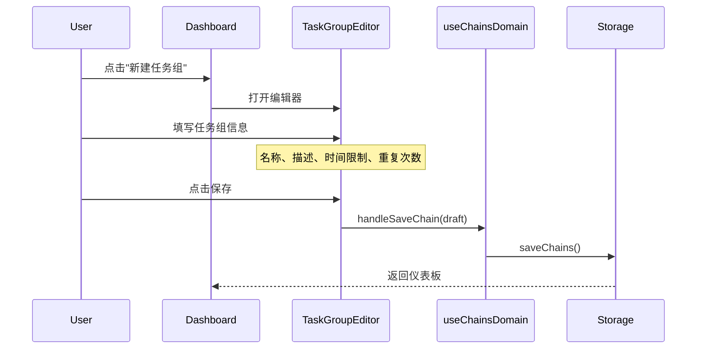
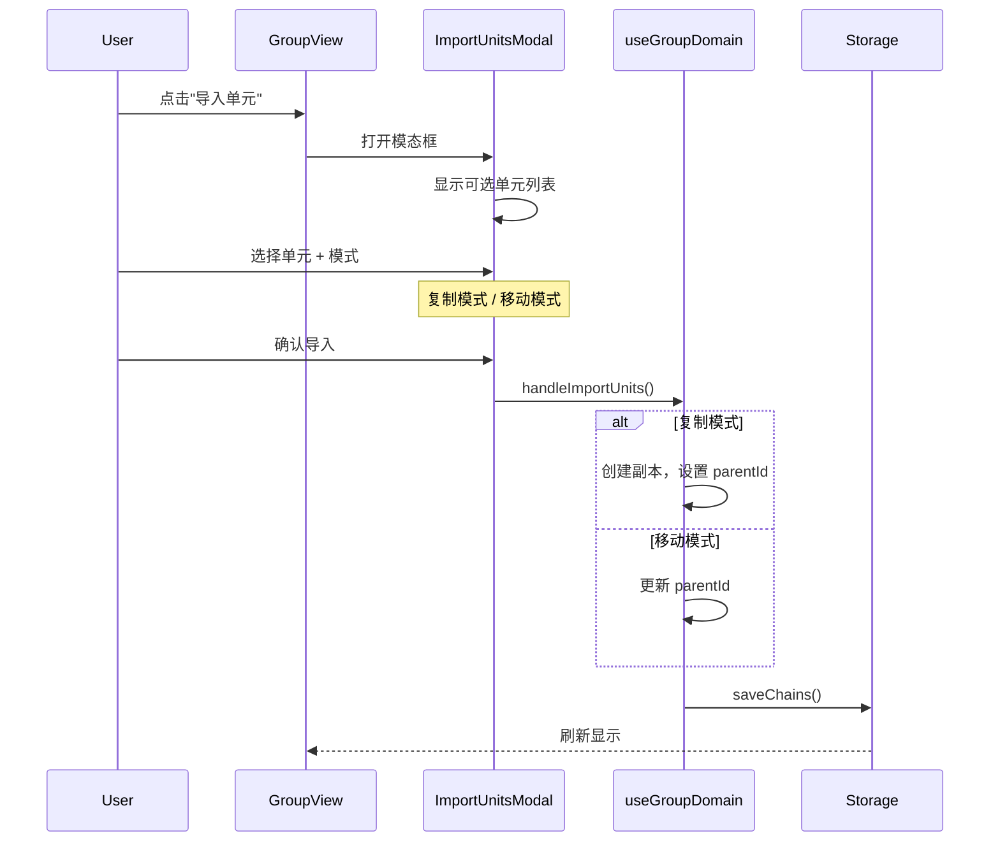
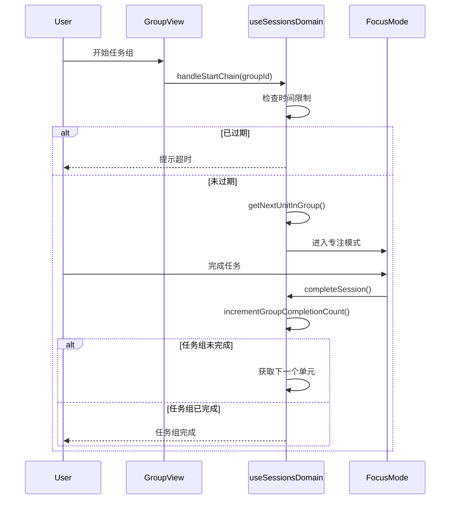

# Groups 领域文档

本文档描述 Momentum 的任务组（Groups/嵌套链）系统，包括设计理念、数据模型和常见操作。

---

## 概述

任务组是一种容器类型的链条，可以包含多个子任务单元，支持循环执行和时间限制功能。通过任务组，用户可以将相关任务组合在一起，按顺序依次完成。

### 核心理念

- **层级结构**：任务组可以包含多个子任务（UnitChain）
- **循环执行**：子任务按顺序执行，完成后自动进入下一个
- **时间限制**：可设置整组的总时间限制
- **重复控制**：每个子任务可设置独立的重复次数

---

## 关键文件

| 文件                                   | 职责                                               |
| -------------------------------------- | -------------------------------------------------- |
| `src/types/index.ts`                   | GroupChain, TaskGroupChain, ChainTreeNode 类型定义 |
| `src/hooks/domains/useGroupDomain.ts`  | 任务组业务逻辑 Hook                                |
| `src/hooks/domains/useChainsDomain.ts` | 创建/编辑任务组                                    |
| `src/utils/chainTree.ts`               | 任务树构建和导航工具                               |
| `src/utils/timeLimit.ts`               | 时间限制处理工具                                   |
| `src/components/TaskGroupEditor.tsx`   | 任务组编辑器组件                                   |
| `src/components/GroupView.tsx`         | 任务组视图组件                                     |
| `src/components/GroupCard.tsx`         | 任务组卡片组件                                     |
| `src/components/ImportUnitsModal.tsx`  | 导入单元模态框                                     |

---

## 数据模型

### 核心类型

```typescript
// src/types/index.ts

// 基础链条字段
interface ChainRecord {
  id: string;
  name: string;
  trigger: string;
  duration: number;
  description: string;
  currentStreak: number;
  auxiliaryStreak: number;
  totalCompletions: number;
  totalFailures: number;
  auxiliaryFailures: number;
  exceptions: string[];
  auxiliaryExceptions: string[];
  auxiliarySignal: string;
  auxiliaryDuration: number;
  auxiliaryCompletionTrigger: string;
  createdAt: Date;
  lastCompletedAt?: Date;
  parentId?: string;
  sortOrder?: number;
  deletedAt?: Date;

  // 任务组相关
  timeLimitHours?: number;
  groupStartedAt?: Date;
  groupExpiresAt?: Date;
  isTaskGroup?: boolean;
  taskRepeatCount?: number;
  groupRepeatCount?: number;
}

// 单元链（普通任务）
type UnitChain = ChainRecord & {
  type:
    | 'unit'
    | 'assault'
    | 'recon'
    | 'command'
    | 'special_ops'
    | 'engineering'
    | 'quartermaster';
};

// 任务组链
type GroupChain = Omit<ChainRecord, 'type'> & {
  type: 'group';
};

// 完整任务组（带重复次数）
type TaskGroupChain = GroupChain & {
  isTaskGroup: true;
  groupRepeatCount: number;
};

// 链条联合类型
type Chain = UnitChain | GroupChain;

// 树节点类型
interface ChainTreeNode {
  id: string;
  chain: Chain;
  children: ChainTreeNode[];
  depth: number;
  sortOrder: number;
}
```

### 数据库字段

| 字段                 | 类型        | 说明               |
| -------------------- | ----------- | ------------------ |
| `parent_id`          | uuid        | 父任务组 ID        |
| `type`               | text        | 'group' 表示任务组 |
| `time_limit_hours`   | integer     | 时间限制（小时）   |
| `group_started_at`   | timestamptz | 任务组开始时间     |
| `group_expires_at`   | timestamptz | 任务组过期时间     |
| `is_task_group`      | boolean     | 是否为任务组       |
| `task_repeat_count`  | integer     | 单个任务重复次数   |
| `group_repeat_count` | integer     | 任务组整体重复次数 |
| `sort_order`         | integer     | 排序顺序           |

---

## 业务流程

### 创建任务组流程



### 导入单元到任务组



### 任务组执行流程



---

## API 参考

### useGroupDomain Hook

| 方法                          | 参数                           | 说明             |
| ----------------------------- | ------------------------------ | ---------------- |
| `handleImportUnits`           | `(unitIds, groupId, mode)`     | 导入单元到任务组 |
| `handleUpdateTaskRepeatCount` | `(chainId, repeatCount)`       | 更新任务重复次数 |
| `handleReorderUnit`           | `(groupId, unitId, direction)` | 上下移动单元排序 |

### chainTree 工具函数

| 函数                                             | 说明                         |
| ------------------------------------------------ | ---------------------------- |
| `buildChainTree(chains)`                         | 构建链条树结构               |
| `getNextUnitInGroup(chains, groupId)`            | 获取任务组中下一个待执行单元 |
| `isGroupFullyCompleted(chains, groupId)`         | 检查任务组是否全部完成       |
| `incrementGroupCompletionCount(chains, groupId)` | 增加完成计数                 |
| `resetGroupCompletionCount(chains, groupId)`     | 重置完成计数                 |

### timeLimit 工具函数

| 函数                        | 说明               |
| --------------------------- | ------------------ |
| `isGroupExpired(chain)`     | 检查任务组是否过期 |
| `startGroupTimer(chain)`    | 开始任务组计时     |
| `resetGroupProgress(chain)` | 重置任务组进度     |

---

## 导入模式

### 复制模式（Copy）

```typescript
// 创建副本并加入任务群，原单元保持独立
const copy: Chain = {
  ...originalChain,
  id: crypto.randomUUID(), // 新 ID
  name: `${chain.name} (副本)`,
  parentId: groupId,
  currentStreak: 0, // 重置记录
  auxiliaryStreak: 0,
  totalCompletions: 0,
  totalFailures: 0,
  auxiliaryFailures: 0,
  createdAt: new Date(),
  lastCompletedAt: undefined,
};
```

### 移动模式（Move）

```typescript
// 更新选中单元的 parentId
const movedChain = {
  ...originalChain,
  parentId: groupId, // 设置父任务组
};
```

---

## 时间限制机制

### 启动计时

当任务组首次开始执行时：

```typescript
const startGroupTimer = (chain: Chain): Chain => {
  if (chain.type !== 'group' || !chain.timeLimitHours) {
    return chain;
  }

  const now = new Date();
  const expiresAt = new Date(
    now.getTime() + chain.timeLimitHours * 60 * 60 * 1000,
  );

  return {
    ...chain,
    groupStartedAt: now,
    groupExpiresAt: expiresAt,
  };
};
```

### 过期检查

```typescript
const isGroupExpired = (chain: Chain): boolean => {
  if (chain.type !== 'group' || !chain.groupExpiresAt) {
    return false;
  }

  return new Date() > new Date(chain.groupExpiresAt);
};
```

### 过期处理

当任务组过期时，进度会被重置：

```typescript
const resetGroupProgress = (chain: Chain): Chain => {
  return {
    ...chain,
    groupStartedAt: undefined,
    groupExpiresAt: undefined,
    // 重置子任务完成计数
  };
};
```

---

## 单元排序

### 上移/下移单元

```typescript
const handleReorderUnit = async (
  groupId: string,
  unitId: string,
  direction: 'up' | 'down',
) => {
  // 1. 获取任务组节点
  const chainTree = buildChainTree(chains);
  const groupNode = chainTree.find((node) => node.id === groupId);

  // 2. 找到目标单元索引
  const idx = groupNode.children.findIndex((child) => child.id === unitId);
  const targetIdx = direction === 'up' ? idx - 1 : idx + 1;

  // 3. 交换 sortOrder
  const a = groupNode.children[idx];
  const b = groupNode.children[targetIdx];
  const updated = chains.map((ch) => {
    if (ch.id === a.id) return { ...ch, sortOrder: b.sortOrder };
    if (ch.id === b.id) return { ...ch, sortOrder: a.sortOrder };
    return ch;
  });

  // 4. 保存
  await saveChains(updated);
};
```

---

## 循环执行逻辑

### 获取下一个单元

```typescript
const getNextUnitInGroup = (chains: Chain[], groupId: string): Chain | null => {
  // 1. 获取任务组的所有子单元
  const children = chains
    .filter((c) => c.parentId === groupId)
    .sort((a, b) => (a.sortOrder ?? 0) - (b.sortOrder ?? 0));

  // 2. 根据完成情况和重复次数确定下一个
  for (const child of children) {
    const repeatCount = child.taskRepeatCount ?? 1;
    if (child.currentStreak < repeatCount) {
      return child;
    }
  }

  return null; // 全部完成
};
```

### 检查是否全部完成

```typescript
const isGroupFullyCompleted = (chains: Chain[], groupId: string): boolean => {
  const children = chains.filter((c) => c.parentId === groupId);

  return children.every((child) => {
    const repeatCount = child.taskRepeatCount ?? 1;
    return child.currentStreak >= repeatCount;
  });
};
```

---

## 使用场景

### 场景：创建学习任务组

```typescript
// 创建任务组
const studyGroup: GroupChain = {
  id: crypto.randomUUID(),
  type: 'group',
  name: '早间学习',
  description: '每日早间学习流程',
  timeLimitHours: 3,
  isTaskGroup: true,
  groupRepeatCount: 1,
  // ... 其他字段
};

// 添加子任务
const readingTask: UnitChain = {
  id: crypto.randomUUID(),
  parentId: studyGroup.id,
  type: 'unit',
  name: '阅读',
  duration: 30,
  taskRepeatCount: 1,
  sortOrder: 0,
  // ...
};

const writingTask: UnitChain = {
  id: crypto.randomUUID(),
  parentId: studyGroup.id,
  type: 'unit',
  name: '写作练习',
  duration: 45,
  taskRepeatCount: 2, // 重复2次
  sortOrder: 1,
  // ...
};
```

### 场景：执行任务组

```typescript
// 开始任务组
const startGroup = async (groupId: string) => {
  const group = chains.find((c) => c.id === groupId);

  // 检查过期
  if (isGroupExpired(group)) {
    const reset = resetGroupProgress(group);
    await saveChains(chains.map((c) => (c.id === groupId ? reset : c)));
    toast.warning('任务组已超时，进度已重置');
    return;
  }

  // 获取下一个单元
  const nextUnit = getNextUnitInGroup(chains, groupId);
  if (!nextUnit) {
    toast.success('任务组已全部完成！');
    return;
  }

  // 开始执行
  await startSession(nextUnit.id);
};
```

---

## 相关文档

- `docs/guides/ARCHITECTURE.md` - 整体架构
- `docs/api/DATABASE_SCHEMA.md` - 数据库结构
- `docs/features/DOMAIN_SESSIONS.md` - 会话管理
- `docs/features/DOMAIN_CHAINS.md` - 链条管理
