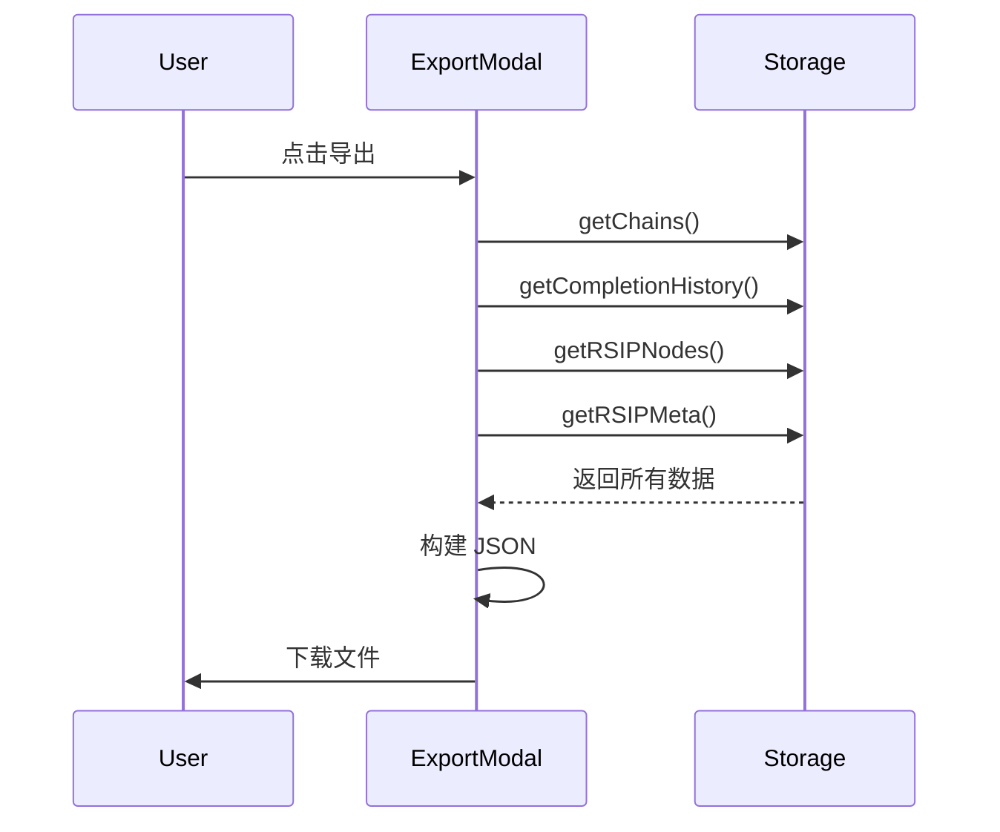
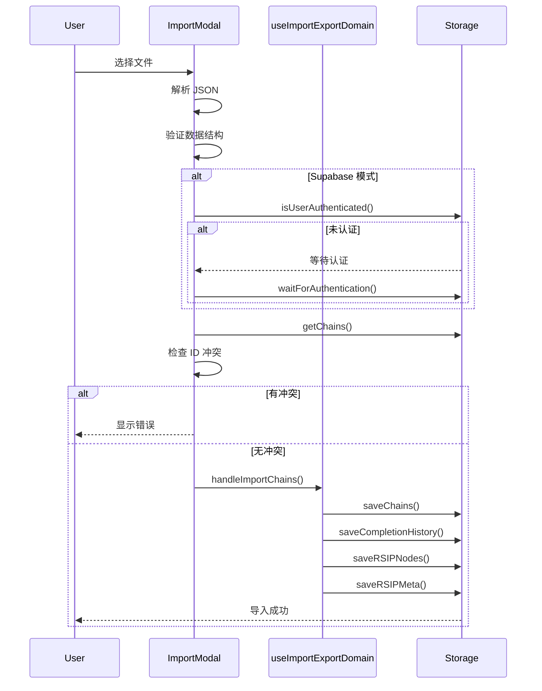

# Import/Export 领域文档

本文档描述 Momentum 的数据导入导出功能，包括支持的数据类型、导入流程和错误处理。

---

## 概述

导入导出功能允许用户备份和迁移 Momentum 的所有数据，包括链条、完成历史、RSIP 节点和例外规则。

### 核心特性
- **完整备份**：导出所有用户数据
- **增量合并**：导入时与现有数据合并
- **ID 冲突检测**：防止数据覆盖
- **身份验证**：Supabase 模式下的安全检查

---

## 关键文件

| 文件 | 职责 |
|------|------|
| `src/hooks/domains/useImportExportDomain.ts` | 导入导出业务逻辑 Hook |
| `src/components/ImportExportModal.tsx` | 导入导出模态框组件 |

---

## 数据模型

### 导出数据结构

```typescript
interface ExportData {
  version: string;           // 数据版本
  exportedAt: Date;          // 导出时间
  chains: Chain[];           // 链条数据
  completionHistory: CompletionHistory[];  // 完成历史
  rsipNodes: RSIPNode[];     // RSIP 节点
  rsipMeta: RSIPMeta;        // RSIP 元数据
  exceptionRules?: ExceptionRule[];  // 例外规则
}
```

### 导入选项

```typescript
interface ImportChainsOptions {
  history?: CompletionHistory[];    // 完成历史
  rsipNodes?: RSIPNode[];           // RSIP 节点
  rsipMeta?: RSIPMeta;              // RSIP 元数据
  exceptionRules?: unknown[];       // 例外规则
}
```

---

## 业务流程

### 导出流程



### 导入流程



---

## API 参考

### useImportExportDomain Hook

| 方法 | 参数 | 说明 |
|------|------|------|
| `handleImportChains` | `(chains, options?)` | 导入链条和其他数据 |

---

## ID 冲突处理

### 检测逻辑

```typescript
// 获取当前最新的链条数据
const currentChains = await storage.getChains();

// 检查 ID 冲突
const existingIds = new Set(currentChains.map(c => c.id));
const conflictingChains = importedChains.filter(c => existingIds.has(c.id));

if (conflictingChains.length > 0) {
  throw new Error(`发现 ${conflictingChains.length} 个 ID 冲突的链条`);
}
```

### 处理策略

- **当前策略**：拒绝导入有冲突的数据
- **未来考虑**：可能支持覆盖或重命名

---

## Supabase 模式认证

在 Supabase 模式下，导入前需要验证用户身份：

```typescript
if (storage.kind === 'supabase') {
  // 检查认证状态
  const isAuth = await storage.isUserAuthenticated();

  if (!isAuth.ok || !isAuth.value) {
    // 等待认证
    const authResult = await storage.waitForAuthentication(10000);

    if (!authResult.ok || !authResult.value.isAuthenticated) {
      throw new Error('导入时身份验证失败');
    }
  }
}
```

---

## 增量合并

导入时采用增量合并策略，不会覆盖现有数据：

```typescript
// 链条合并
const updatedChains = [...currentChains, ...importedChains];

// 历史合并
const existing = await storage.getCompletionHistory();
const merged = [...existing, ...importedHistory];

// RSIP 节点合并
const existingNodes = await storage.getRSIPNodes();
const mergedNodes = [...existingNodes, ...importedRsipNodes];

// RSIP 元数据合并
const existingMeta = await storage.getRSIPMeta();
const mergedMeta = { ...existingMeta, ...importedRsipMeta };
```

---

## 错误恢复

导入失败时，会重新加载数据以确保状态一致性：

```typescript
try {
  await handleImportChains(chains, options);
} catch (error) {
  // 重新加载数据
  const currentChains = await storage.getChains();
  const currentRsipNodes = await storage.getRSIPNodes();
  const currentRsipMeta = await storage.getRSIPMeta();

  setState(prev => ({
    ...prev,
    chains: currentChains,
    rsipNodes: currentRsipNodes,
    rsipMeta: currentRsipMeta,
  }));

  throw error;
}
```

---

## 使用场景

### 场景：完整备份

```typescript
const exportAllData = async () => {
  const data: ExportData = {
    version: '1.0',
    exportedAt: new Date(),
    chains: await storage.getChains(),
    completionHistory: await storage.getCompletionHistory(),
    rsipNodes: await storage.getRSIPNodes(),
    rsipMeta: await storage.getRSIPMeta(),
  };

  const blob = new Blob([JSON.stringify(data, null, 2)], {
    type: 'application/json',
  });

  // 下载文件
  const url = URL.createObjectURL(blob);
  const a = document.createElement('a');
  a.href = url;
  a.download = `momentum-backup-${Date.now()}.json`;
  a.click();
};
```

### 场景：导入备份

```typescript
const importBackup = async (file: File) => {
  const text = await file.text();
  const data: ExportData = JSON.parse(text);

  await handleImportChains(data.chains, {
    history: data.completionHistory,
    rsipNodes: data.rsipNodes,
    rsipMeta: data.rsipMeta,
  });

  toast.success('导入成功！');
};
```

---

## 相关文档

- `docs/guides/ARCHITECTURE.md` - 整体架构
- `docs/features/DOMAIN_RSIP.md` - RSIP 系统
- `docs/features/DOMAIN_CHAINS.md` - 链条管理
