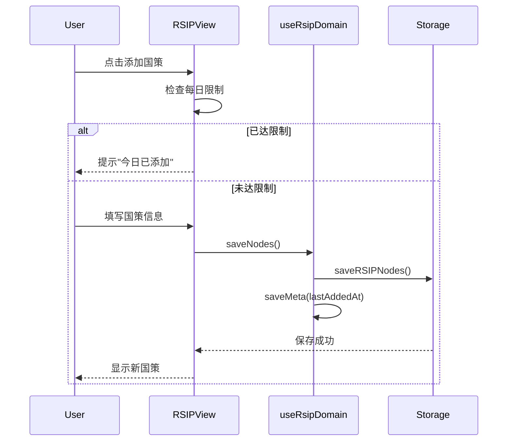
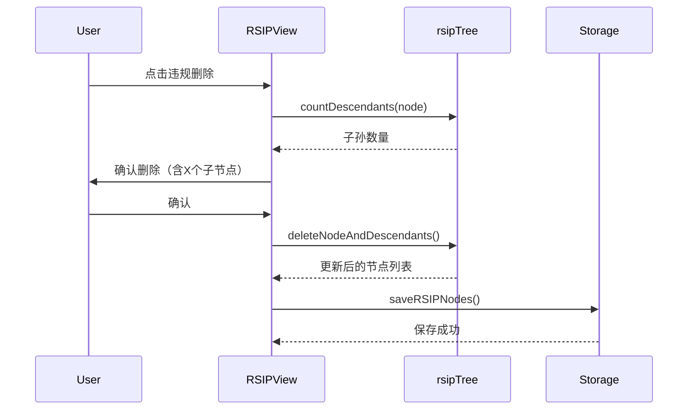

# RSIP 领域文档

本文档描述 Momentum 的 RSIP（递归稳态迭代协议）系统，包括设计理念、数据模型和常见操作。

---

## 概述

RSIP（Recursive Steady-state Iteration Protocol，递归稳态迭代协议）是一个个人规则管理系统，类似于"个人宪法"或"生活准则"。它帮助用户建立和维护长期习惯和行为规范。

### 核心理念

- **层级规则**：规则可以有父子关系，形成规则树
- **每日限制**：默认每天只能添加一条新规则，防止过度承诺
- **违规回滚**：违反规则时，该节点及其所有子节点将被删除
- **渐进式建立**：通过时间积累，逐步建立稳定的生活秩序
- **稳态迁移**：定式从 E0（新建）→ E1（稳定）→ E2（内化）逐步升级

---

## 双模式系统

RSIP 支持两种运行模式，通过 `allowMultiplePerDay` 设置切换：

### 模式对比

| 功能         | 自由模式 | 严格模式       |
| ------------ | -------- | -------------- |
| 每日添加限制 | 无限制   | 每天最多 1 条  |
| 定式执行追踪 | ❌       | ✅             |
| 稳态迁移追踪 | ❌       | ✅             |
| 堆栈删除机制 | 手动删除 | 违反时自动触发 |
| 约束力可视化 | ❌       | ✅             |
| 每日打开提醒 | ❌       | ✅             |

### 自由模式

适用于新手入门或灵活使用场景：

- 可以一天添加多条定式
- 简单的定式列表展示
- 手动管理定式

### 严格模式

完整实现原作者 RSIP 理念：

- 每天最多添加 1 条定式
- 定式执行/违反追踪
- 稳态阶段可视化（E0/E1/E2）
- 约束力指标显示
- 违反时触发堆栈删除

---

## 稳态阶段系统（严格模式）

### 三个稳态阶段

| 阶段 | 名称 | 图标 | 升级条件       | 说明         |
| ---- | ---- | ---- | -------------- | ------------ |
| E0   | 新建 | 🌱   | -              | 刚创建的定式 |
| E1   | 稳定 | 🌿   | 连续执行 7 天  | 初步形成习惯 |
| E2   | 内化 | 🌳   | 连续执行 21 天 | 习惯已内化   |

### 稳态迁移规则

```
E0 (新建) ──[连续7天执行]──> E1 (稳定) ──[连续21天执行]──> E2 (内化)
```

- **升级**：连续执行达到阈值后自动升级
- **重置**：违反定式时，该定式及所有子定式被删除

### 约束力计算

约束力（失败代价）= (子节点数 + 1) × 稳态权重

| 稳态阶段 | 权重 |
| -------- | ---- |
| E0       | 1    |
| E1       | 2    |
| E2       | 3    |

**示例**：一个 E2 阶段的定式有 4 个子节点，失败代价 = (4 + 1) × 3 = 15

---

## 关键文件

| 文件                                              | 职责                                             |
| ------------------------------------------------- | ------------------------------------------------ |
| `src/types/index.ts`                              | RSIPNode, RSIPMeta, RSIPExecutionRecord 类型定义 |
| `src/hooks/domains/useRsipDomain.ts`              | RSIP 业务逻辑 Hook                               |
| `src/utils/rsipTree.ts`                           | RSIP 树结构工具函数                              |
| `src/infra/storage/supabase/rsip.ts`              | Supabase 存储实现                                |
| `src/components/RSIPView.tsx`                     | RSIP 视图组件                                    |
| `src/components/rsip/RSIPStrictModeCard.tsx`      | 严格模式定式卡片                                 |
| `src/components/rsip/RSIPPhaseBadge.tsx`          | 稳态阶段徽章                                     |
| `src/components/rsip/RSIPPhaseProgress.tsx`       | 稳态进度条                                       |
| `src/components/rsip/RSIPConstraintIndicator.tsx` | 约束力指标                                       |
| `src/components/rsip/RSIPModeSwitch.tsx`          | 模式切换组件                                     |
| `src/components/rsip/RSIPDailyReminder.tsx`       | 每日提醒横幅                                     |
| `src/components/rsip/RSIPViolationDialog.tsx`     | 违反确认对话框                                   |

---

## 数据模型

### 核心类型

```typescript
// src/types/index.ts

// 稳态阶段类型
type RSIPStabilityPhase = 'E0' | 'E1' | 'E2';

// RSIP 模式类型
type RSIPMode = 'free' | 'strict';

interface RSIPNode {
  id: string;
  parentId?: string; // 父节点ID
  title: string; // 国策/定式名称
  rule: string; // 精准、可执行的规则描述
  sortOrder: number; // 排序（同一父节点下）
  createdAt: Date; // 创建时间

  // 可选计时配置
  useTimer?: boolean; // 是否使用计时
  timerMinutes?: number; // 倒计时分钟数

  // UI 展示
  emoji?: string; // 展示图标

  // 严格模式字段
  stabilityPhase?: RSIPStabilityPhase; // 稳态阶段
  phaseStartedAt?: Date; // 当前阶段开始时间
  lastExecutedAt?: Date; // 最近执行时间
  lastViolatedAt?: Date; // 最近违反时间
  consecutiveExecutions?: number; // 连续执行次数
  consecutiveViolations?: number; // 连续违反次数
  totalExecutions?: number; // 总执行次数
  totalViolations?: number; // 总违反次数
}

interface RSIPMeta {
  lastAddedAt?: Date; // 最近一次添加时间
  allowMultiplePerDay?: boolean; // 是否允许一天添加多条（false=严格模式）

  // 严格模式字段
  lastTreeOpenedAt?: Date; // 最近打开国策树时间
  dailyTreeOpenRequired?: boolean; // 是否要求每日打开
  treeOpenStreak?: number; // 连续打开天数
}

// 执行记录（严格模式）
interface RSIPExecutionRecord {
  id: string;
  userId: string;
  nodeId: string;
  executedAt: Date;
  status: 'pending' | 'executed' | 'violated' | 'skipped';
  notes?: string;
}
```

### 数据库表

#### rsip_nodes

```sql
id: uuid PRIMARY KEY
user_id: uuid NOT NULL
parent_id: uuid             -- 父节点 ID
title: text NOT NULL        -- 国策名称
rule: text NOT NULL         -- 规则描述
sort_order: integer DEFAULT 0
use_timer: boolean DEFAULT false
timer_minutes: integer
emoji: text
created_at: timestamptz DEFAULT now()

-- 严格模式字段
stability_phase: text DEFAULT 'E0'
phase_started_at: timestamptz
last_executed_at: timestamptz
last_violated_at: timestamptz
consecutive_executions: integer DEFAULT 0
consecutive_violations: integer DEFAULT 0
total_executions: integer DEFAULT 0
total_violations: integer DEFAULT 0
```

#### rsip_meta

```sql
user_id: uuid PRIMARY KEY
last_added_at: timestamptz
allow_multiple_per_day: boolean DEFAULT false

-- 严格模式字段
last_tree_opened_at: timestamptz
daily_tree_open_required: boolean DEFAULT false
tree_open_streak: integer DEFAULT 0
```

#### rsip_execution_records（严格模式）

```sql
id: uuid PRIMARY KEY DEFAULT gen_random_uuid()
user_id: uuid NOT NULL REFERENCES auth.users(id) ON DELETE CASCADE
node_id: uuid NOT NULL REFERENCES rsip_nodes(id) ON DELETE CASCADE
executed_at: timestamptz DEFAULT NOW()
status: text NOT NULL CHECK (status IN ('pending', 'executed', 'violated', 'skipped'))
notes: text
```

---

## 树结构操作

### 构建树结构

```typescript
// src/utils/rsipTree.ts

/**
 * 将扁平的 RSIP 节点数组转换为树状结构
 */
export const buildRSIPTree = (nodes: RSIPNode[]): RSIPTreeNode[] => {
  // 1. 初始化节点 Map
  // 2. 建立父子关系
  // 3. 按 sortOrder 排序
  // 4. 返回根节点列表
};
```

### 计算子孙数量

```typescript
/**
 * 计算某节点的子孙数量（用于失败删除时的提示）
 */
export const countDescendants = (node: RSIPTreeNode): number => {
  let count = node.children.length;
  node.children.forEach((c) => {
    count += countDescendants(c);
  });
  return count;
};
```

### 删除节点及子节点

```typescript
/**
 * 删除节点及其所有子节点，返回新数组
 */
export const deleteNodeAndDescendants = (
  nodes: RSIPNode[],
  nodeId: string,
): RSIPNode[] => {
  // 递归收集所有需要删除的 ID
  // 过滤并返回新数组
};
```

---

## 业务流程

### 添加国策流程



### 违规删除流程



---

## API 参考

### useRsipDomain Hook

#### 基础方法

| 方法               | 说明                         |
| ------------------ | ---------------------------- |
| `openRSIP()`       | 打开 RSIP 视图               |
| `saveNodes(nodes)` | 保存 RSIP 节点列表           |
| `saveMeta(meta)`   | 保存 RSIP 元数据（乐观更新） |

#### 严格模式方法

| 方法                                      | 说明                               |
| ----------------------------------------- | ---------------------------------- |
| `getMode(meta)`                           | 获取当前模式（'free' \| 'strict'） |
| `isStrictMode(meta)`                      | 判断是否为严格模式                 |
| `markExecuted(nodeId, nodes, notes?)`     | 标记定式已执行                     |
| `markViolated(nodeId, nodes, notes?)`     | 标记定式已违反（触发堆栈删除）     |
| `recordTreeOpened(meta)`                  | 记录今日已打开国策树               |
| `hasOpenedToday(meta)`                    | 检查今日是否已打开国策树           |
| `calculateConstraintPower(nodeId, nodes)` | 计算约束力（子节点数、失败代价）   |
| `calculatePhaseDistribution(nodes)`       | 计算各阶段定式数量分布             |

### rsipTree 工具函数

| 函数                                      | 说明             |
| ----------------------------------------- | ---------------- |
| `buildRSIPTree(nodes)`                    | 构建树结构       |
| `countDescendants(node)`                  | 计算子孙数量     |
| `deleteNodeAndDescendants(nodes, nodeId)` | 删除节点及子节点 |

---

## 每日限制机制

### 检查逻辑

```typescript
const canAddToday = (meta: RSIPMeta): boolean => {
  // 如果允许多条，直接返回 true
  if (meta.allowMultiplePerDay) return true;

  // 检查是否同一天
  if (!meta.lastAddedAt) return true;

  const today = new Date();
  const lastAdded = new Date(meta.lastAddedAt);
  return today.toDateString() !== lastAdded.toDateString();
};
```

### 设计理由

- 防止用户一时冲动添加过多规则
- 强制用户深思熟虑每条规则
- 通过时间积累建立真正可执行的规则体系

---

## 使用场景

### 场景：创建根级国策

```typescript
const newNode: RSIPNode = {
  id: crypto.randomUUID(),
  parentId: undefined, // 根级节点
  title: '早起',
  rule: '每天早上 7:00 前起床',
  sortOrder: 0,
  createdAt: new Date(),
  emoji: '🌅',
};

await saveNodes([...existingNodes, newNode]);
await saveMeta({ lastAddedAt: new Date() });
```

### 场景：创建子规则

```typescript
const childNode: RSIPNode = {
  id: crypto.randomUUID(),
  parentId: 'parent-node-id', // 指定父节点
  title: '早起后晨练',
  rule: '早起后进行 15 分钟拉伸运动',
  sortOrder: 0,
  createdAt: new Date(),
  emoji: '🏃',
};

await saveNodes([...existingNodes, childNode]);
```

### 场景：违规删除

```typescript
// 用户违反了某条规则
const nodeToDelete = 'violated-node-id';

// 计算影响范围
const tree = buildRSIPTree(nodes);
const node = findNodeInTree(tree, nodeToDelete);
const descendantCount = countDescendants(node);

// 确认后删除
if (confirm(`此操作将删除该节点及其 ${descendantCount} 个子节点`)) {
  const updatedNodes = deleteNodeAndDescendants(nodes, nodeToDelete);
  await saveNodes(updatedNodes);
}
```

---

## 与其他系统的集成

### 与导入导出集成

RSIP 节点可以通过导入导出功能备份和迁移：

```typescript
// 导出
const exportData = {
  chains: [...],
  rsipNodes: await storage.getRSIPNodes(),
  rsipMeta: await storage.getRSIPMeta(),
};

// 导入
await handleImportChains(importedChains, {
  rsipNodes: importData.rsipNodes,
  rsipMeta: importData.rsipMeta,
});
```

---

## 严格模式 UI 组件

### RSIPModeSwitch - 模式切换

切换自由/严格模式的组件：

```tsx
<RSIPModeSwitch
  mode={isStrictMode ? 'strict' : 'free'}
  onModeChange={(mode) => {
    saveMeta({ ...meta, allowMultiplePerDay: mode === 'free' });
  }}
/>
```

### RSIPPhaseBadge - 稳态徽章

显示定式的稳态阶段：

```tsx
<RSIPPhaseBadge phase="E1" size="md" />
// 显示: 🌿 E1 稳定
```

### RSIPPhaseProgress - 稳态进度条

显示距离下一阶段的进度：

```tsx
<RSIPPhaseProgress phase="E0" consecutiveDays={5} />
// 显示: → E1  5/7 天
```

### RSIPConstraintIndicator - 约束力指标

显示子节点数量和失败代价：

```tsx
<RSIPConstraintIndicator descendantCount={4} failureCost={15} />
// 显示: 🌿 4 子节点  ⚠️ 代价 15
```

### RSIPStrictModeCard - 严格模式卡片

完整的定式卡片，包含所有严格模式功能：

```tsx
<RSIPStrictModeCard
  node={node}
  descendantCount={4}
  failureCost={15}
  onMarkExecuted={() => markExecuted(node.id, nodes)}
  onMarkViolated={() => setViolationDialogNode(node)}
/>
```

### RSIPDailyReminder - 每日提醒

显示每日打开国策树的提醒横幅：

```tsx
{
  !hasOpenedToday(meta) && (
    <RSIPDailyReminder
      treeOpenStreak={meta.treeOpenStreak}
      onRecordOpened={() => recordTreeOpened(meta)}
    />
  );
}
```

### RSIPViolationDialog - 违反确认对话框

确认违反定式时显示的对话框：

```tsx
<RSIPViolationDialog
  isOpen={!!violationNode}
  node={violationNode}
  descendants={getDescendants(nodes, violationNode.id)}
  onConfirm={() => markViolated(violationNode.id, nodes)}
  onCancel={() => setViolationNode(null)}
/>
```

---

## 严格模式使用场景

### 场景：标记定式已执行

```typescript
// 用户完成了定式
const updatedNodes = await markExecuted(nodeId, nodes);

// 内部逻辑：
// 1. consecutiveExecutions + 1
// 2. totalExecutions + 1
// 3. consecutiveViolations 重置为 0
// 4. 检查是否达到升级阈值（7天→E1，21天→E2）
// 5. 更新 lastExecutedAt
```

### 场景：标记定式已违反

```typescript
// 用户违反了定式
const updatedNodes = await markViolated(nodeId, nodes);

// 内部逻辑：
// 1. 获取该节点及所有子孙节点的 ID
// 2. 从节点列表中删除这些节点
// 3. 保存更新后的节点列表
```

### 场景：每日打开国策树

```typescript
// 用户打开国策树时
const updatedMeta = await recordTreeOpened(meta);

// 内部逻辑：
// 1. 检查今日是否已打开
// 2. 如果昨天也打开过，treeOpenStreak + 1
// 3. 否则 treeOpenStreak 重置为 1
// 4. 更新 lastTreeOpenedAt
```

---

## 相关文档

- `docs/guides/ARCHITECTURE.md` - 整体架构
- `docs/api/DATABASE_SCHEMA.md` - 数据库结构
- `docs/features/DOMAIN_IMPORT_EXPORT.md` - 导入导出功能
- `docs/modules/RSIP_PROTOCOL.md` - RSIP 协议详情
- `docs/guides/如何提高自制力？-edmond的回答.md` - 原作者理论文章（中文）
- `docs/guides/How to Improve Self-Control by edmond EN.md` - 原作者理论文章（英文）
