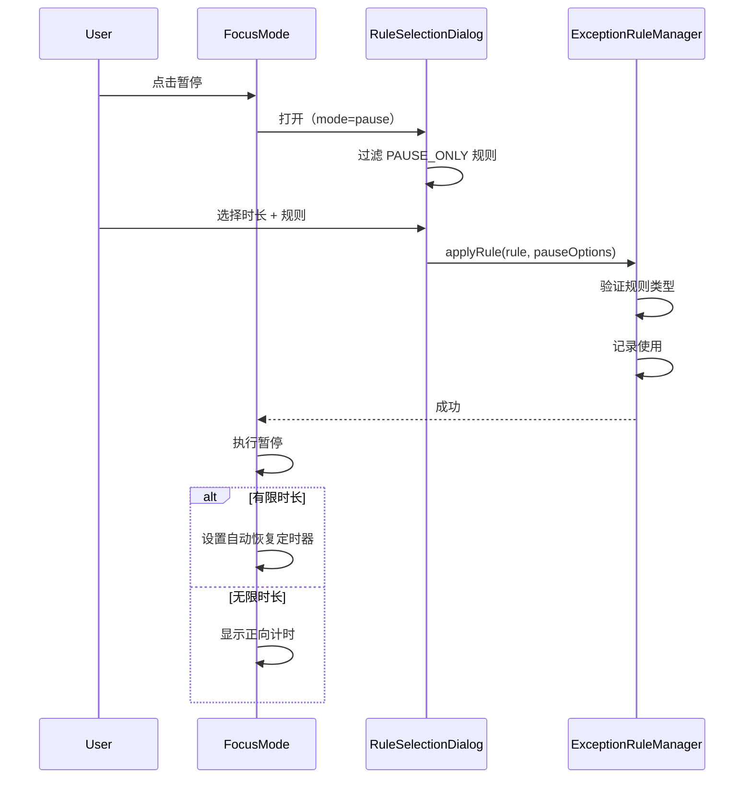
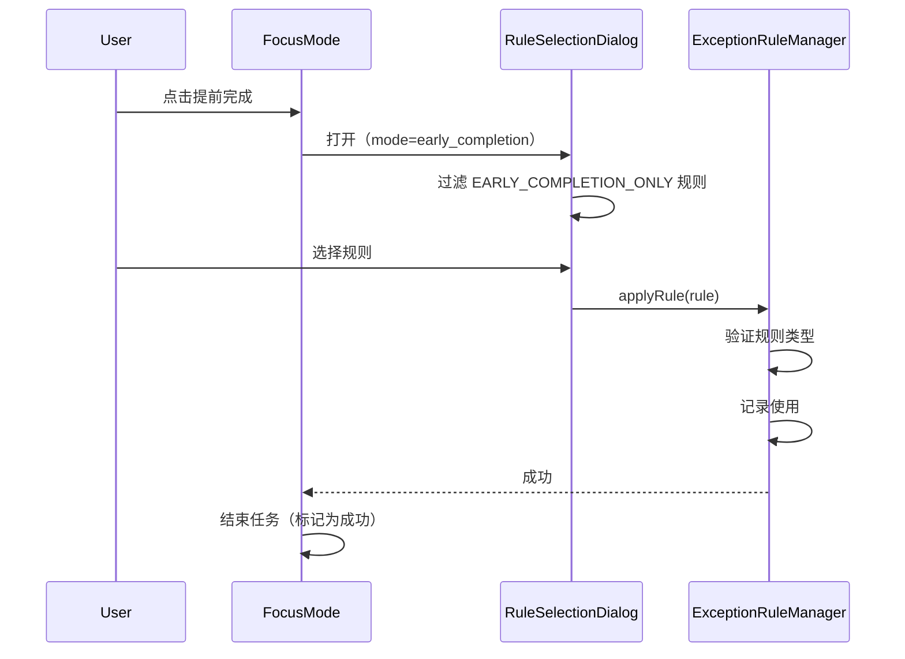

# Exception Rules 领域文档

本文档描述 Momentum 的例外规则系统，包括规则分类、暂停机制、服务架构和常见操作。

---

## 概述

例外规则系统允许用户在专注模式下进行有纪律的暂停或提前完成操作。每次操作必须选择一个规则，系统会记录使用情况用于后续分析。

### 核心理念
- **有纪律的中断**：每次暂停/提前完成都需要明确理由
- **严格分类**：规则只能用于一种操作（暂停 OR 提前完成）
- **使用追踪**：记录每次规则使用，便于复盘

---

## 关键文件

| 文件 | 职责 |
|------|------|
| `src/types/index.ts` | 核心类型定义（ExceptionRule, RuleUsageRecord 等） |
| `src/hooks/domains/useRulesDomain.ts` | 业务逻辑 Hook |
| `src/services/ExceptionRuleManager.ts` | 核心管理器 |
| `src/services/RuleClassificationService.ts` | 规则分类验证 |
| `src/services/RuleStateManager.ts` | 规则状态管理 |
| `src/services/RuleDuplicationDetector.ts` | 重复检测 |
| `src/services/RuleUsageTracker.ts` | 使用记录追踪 |
| `src/services/EnhancedRuleValidationService.ts` | 增强验证 |
| `src/services/DataIntegrityChecker.ts` | 数据完整性检查 |
| `src/services/ErrorRecoveryManager.ts` | 错误恢复 |

---

## 数据模型

### 核心类型

```typescript
// src/types/index.ts

enum ExceptionRuleType {
  PAUSE_ONLY = 'pause_only',              // 仅用于暂停
  EARLY_COMPLETION_ONLY = 'early_completion_only'  // 仅用于提前完成
}

interface ExceptionRule {
  id: string;
  name: string;
  description?: string;
  type: ExceptionRuleType;
  chainId?: string;           // 关联链ID（null = 全局规则）
  scope: 'chain' | 'global';
  createdAt: Date;
  lastUsedAt?: Date;
  usageCount: number;
  isActive: boolean;
  isArchived?: boolean;
}

interface RuleUsageRecord {
  id: string;
  ruleId: string;
  chainId: string;
  sessionId: string;
  usedAt: Date;
  actionType: 'pause' | 'early_completion';
  taskElapsedTime: number;     // 使用时任务已进行时间（秒）
  taskRemainingTime?: number;  // 剩余时间
  pauseDuration?: number;      // 暂停时长（秒）
  autoResume?: boolean;        // 是否自动恢复
  ruleScope: 'chain' | 'global';
}

interface PauseOptions {
  duration?: number;           // 暂停时长（秒），undefined = 无限
  autoResume?: boolean;
}
```

### 增强错误类型

```typescript
enum ExceptionRuleError {
  // 用户操作错误
  RULE_NOT_FOUND = 'RULE_NOT_FOUND',
  DUPLICATE_RULE_NAME = 'DUPLICATE_RULE_NAME',
  INVALID_RULE_TYPE = 'INVALID_RULE_TYPE',
  RULE_TYPE_MISMATCH = 'RULE_TYPE_MISMATCH',
  VALIDATION_ERROR = 'VALIDATION_ERROR',

  // 系统错误
  STORAGE_ERROR = 'STORAGE_ERROR',
  OPERATION_TIMEOUT = 'OPERATION_TIMEOUT',
  CONCURRENT_MODIFICATION = 'CONCURRENT_MODIFICATION',

  // 数据错误
  DATA_INTEGRITY_ERROR = 'DATA_INTEGRITY_ERROR',
  TEMPORARY_ID_CONFLICT = 'TEMPORARY_ID_CONFLICT',
  RULE_STATE_INCONSISTENT = 'RULE_STATE_INCONSISTENT',
  RECOVERY_FAILED = 'RECOVERY_FAILED',

  // 网络错误
  NETWORK_ERROR = 'NETWORK_ERROR',
  PERMISSION_DENIED = 'PERMISSION_DENIED'
}
```

---

## 服务架构

```
ExceptionRuleManager (主管理器)
├── EnhancedRuleValidationService (验证服务)
│   └── 预验证、批量验证、缓存
├── EnhancedDuplicationHandler (重复处理)
│   └── 实时检测、智能命名建议
├── RuleStateManager (状态管理)
│   └── 生命周期追踪、ID映射
├── RuleClassificationService (分类服务)
│   └── 类型验证、操作匹配
├── RuleUsageTracker (使用追踪)
│   └── 记录使用、统计分析
├── DataIntegrityChecker (完整性检查)
│   └── 检查问题、自动修复
├── ErrorRecoveryManager (错误恢复)
│   └── 智能分析、恢复策略
└── UserFeedbackHandler (用户反馈)
    └── 进度指示、错误展示
```

---

## 暂停功能

### 暂停时长选项

| 选项 | 时长 | 自动恢复 |
|------|------|:--------:|
| 短暂休息 | 15 分钟 | ✓ |
| 中等休息 | 30 分钟 | ✓ |
| 长休息 | 60 分钟 | ✓ |
| 无限暂停 | - | ✗ |

### 暂停流程



### 提前完成流程



---

## API 参考

### ExceptionRuleManager 主要方法

| 方法 | 说明 |
|------|------|
| `initialize()` | 初始化（自动完整性检查） |
| `createRule(name, type, description, userChoice)` | 创建规则 |
| `getRule(id)` | 获取单个规则 |
| `getAllRules()` | 获取所有规则 |
| `getRulesForAction(actionType)` | 按操作类型获取规则 |
| `applyRule(rule, context, options)` | 应用规则 |
| `updateRule(id, updates)` | 更新规则 |
| `deleteRule(id)` | 删除规则 |
| `archiveRule(id)` | 归档规则 |

### RuleClassificationService 方法

| 方法 | 说明 |
|------|------|
| `validateRuleForAction(rule, actionType)` | 验证规则是否适用于操作 |
| `canUsePauseOnlyRule(rule)` | 检查是否可用于暂停 |
| `canUseEarlyCompletionRule(rule)` | 检查是否可用于提前完成 |

### RuleUsageTracker 方法

| 方法 | 说明 |
|------|------|
| `recordUsage(ruleId, context, pauseOptions)` | 记录使用 |
| `getRuleUsageStats(ruleId)` | 获取规则统计 |
| `getOverallStats()` | 获取总体统计 |

---

## 错误处理

### EnhancedExceptionRuleException

```typescript
class EnhancedExceptionRuleException extends ExceptionRuleException {
  type: ExceptionRuleError;
  message: string;
  userMessage: string;        // 用户友好消息
  severity: 'low' | 'medium' | 'high' | 'critical';
  recoverable: boolean;
  suggestedActions: string[];
  context: any;

  // 快捷创建方法
  static createUserFriendly(type, userMessage, technicalMessage, context);
  static createCritical(type, message, context);
  static createRecoverable(type, message, suggestedActions, context);

  // 分类
  getCategory(): 'user_error' | 'system_error' | 'data_error' | 'network_error';
}
```

### 错误分类处理

| 类别 | 错误类型 | 处理策略 |
|------|----------|----------|
| 用户错误 | VALIDATION_ERROR, DUPLICATE_RULE_NAME | 显示提示，引导修正 |
| 系统错误 | STORAGE_ERROR, OPERATION_TIMEOUT | 重试，降级处理 |
| 数据错误 | DATA_INTEGRITY_ERROR, RULE_STATE_INCONSISTENT | 自动修复 |
| 网络错误 | NETWORK_ERROR | 重试，离线模式 |

---

## 数据完整性

### 自动检查项

| 检查项 | 说明 | 自动修复 |
|--------|------|:--------:|
| 孤立使用记录 | 引用不存在的规则 | ✓ |
| 无效规则类型 | type 字段值非法 | ✓ |
| 重复 ID | 多个规则使用相同 ID | ✓ |
| 状态不一致 | isActive 与 isArchived 冲突 | ✓ |

### 手动检查

```typescript
// 运行完整性检查
const report = await dataIntegrityChecker.checkRuleDataIntegrity();

if (report.issues.length > 0) {
  // 自动修复可修复的问题
  const fixable = report.issues.filter(i => i.autoFixable);
  const results = await dataIntegrityChecker.autoFixIssues(fixable);
}
```

---

## 缓存策略

| 缓存 | TTL | 说明 |
|------|-----|------|
| 验证结果 | 5 分钟 | 规则可用性预检结果 |
| 重复检查 | 2 分钟 | 名称重复检测结果 |
| 规则列表 | 请求级 | 避免同一请求多次读取 |

### 缓存清理

```typescript
// 清理过期缓存
enhancedRuleValidationService.cleanupExpiredCache();
enhancedDuplicationHandler.cleanupExpiredCache();
```

---

## 常见操作场景

### 场景：创建暂停规则

```typescript
const result = await exceptionRuleManager.createRule(
  '接电话',
  ExceptionRuleType.PAUSE_ONLY,
  '有重要电话需要接听'
);

if (result.warnings.length > 0) {
  // 可能有名称相似的规则
}
```

### 场景：应用规则暂停任务

```typescript
const context: SessionContext = {
  sessionId: activeSession.id,
  chainId: chain.id,
  chainName: chain.name,
  startedAt: activeSession.startedAt,
  elapsedTime: calculateElapsedTime(),
  remainingTime: calculateRemainingTime(),
  isDurationless: chain.isDurationless ?? false,
};

const pauseOptions: PauseOptions = {
  duration: 15 * 60,  // 15 分钟
  autoResume: true,
};

await exceptionRuleManager.applyRule(selectedRule, context, pauseOptions);
```

### 场景：处理重复规则名称

```typescript
const result = await exceptionRuleManager.createRule(
  '午休',
  ExceptionRuleType.PAUSE_ONLY,
  undefined,
  'modify_name'  // 自动修改名称（如"午休 (2)"）
);
```

---

## 性能指标

### v2.0 改进

| 指标 | 改进前 | 改进后 |
|------|--------|--------|
| 规则验证 | 500ms | 200ms |
| 重复检查 | 300ms | 100ms |
| 错误恢复 | 1000ms | 500ms |
| 创建失败率 | 15% | 2% |
| 验证错误率 | 10% | 1% |

---

## 初始化流程

ExceptionRuleManager 在首次使用时自动初始化：

```typescript
async initialize(): Promise<void> {
  // 1. 运行数据完整性检查
  const report = await dataIntegrityChecker.checkRuleDataIntegrity();

  // 2. 自动修复可修复的问题
  if (report.issues.length > 0) {
    const fixable = report.issues.filter(i => i.autoFixable);
    await dataIntegrityChecker.autoFixIssues(fixable);
  }

  // 3. 同步规则状态
  await ruleStateManager.syncRuleStates();

  // 4. 清理过期缓存
  enhancedRuleValidationService.cleanupExpiredCache();
  enhancedDuplicationHandler.cleanupExpiredCache();
}
```

---

## 迁移与兼容

### 从旧版迁移

系统自动处理以下迁移：
1. 旧版规则类型自动映射到新枚举
2. 缺少 scope 字段的规则自动设置为 'global'
3. 缺少 usageCount 的规则自动初始化为 0

### 向后兼容

- 旧版 API 签名保持兼容
- 新字段（如 pauseDuration, autoResume）为可选
- 存储格式保持 JSON 兼容

---

## 相关文档

- `docs/guides/ARCHITECTURE.md` - 整体架构
- `docs/features/DOMAIN_BETTING.md` - 赌注系统
- `DEBUGGING_GUIDE.md` - 调试指南
