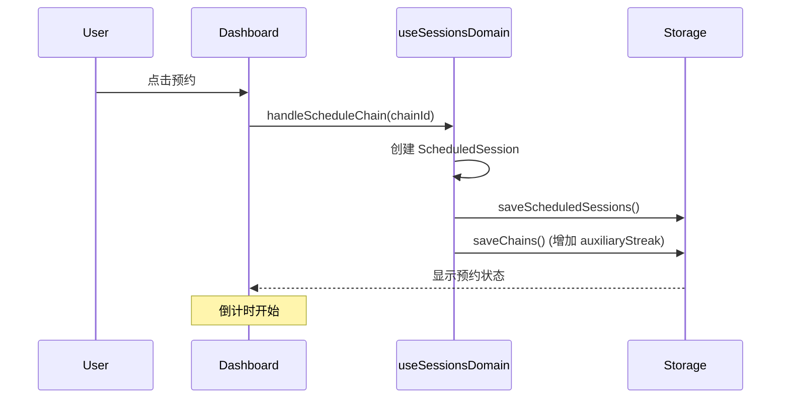
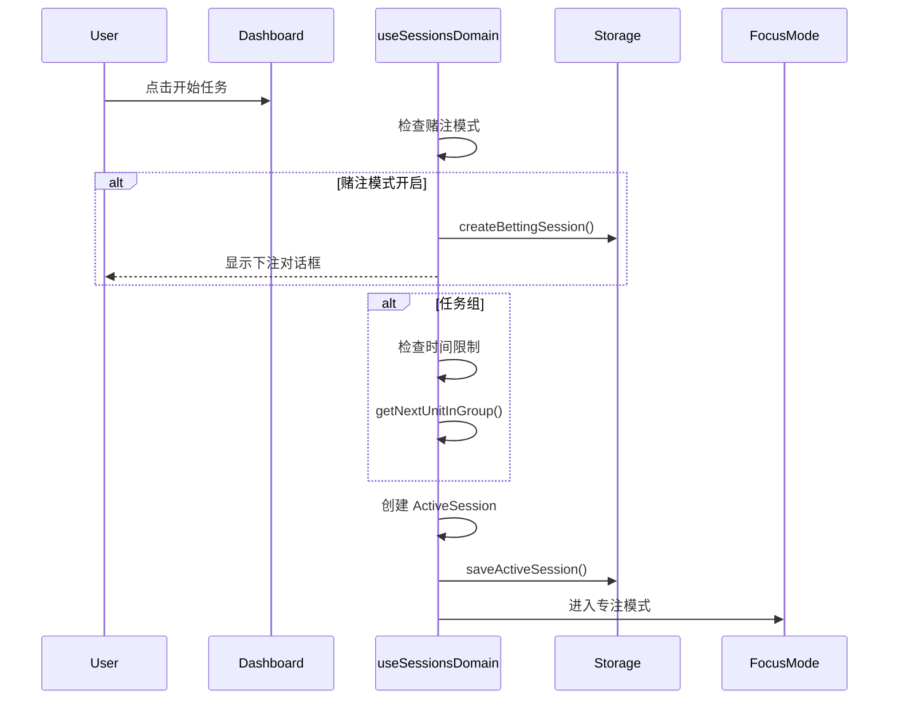
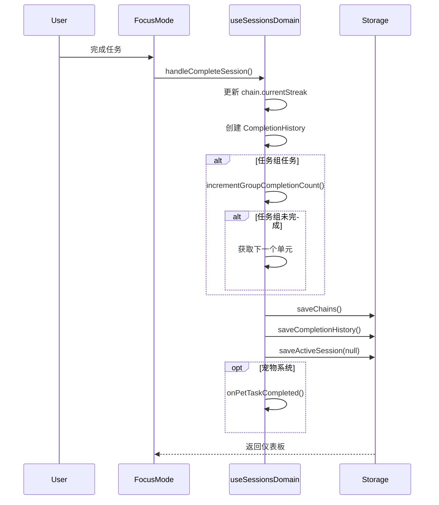

# Sessions 领域文档

本文档描述 Momentum 的任务会话生命周期管理，包括预约、执行、完成和中断流程。

---

## 概述

会话系统管理任务的完整生命周期，从预约到完成，支持暂停、恢复、中断等操作，并与赌注和宠物系统集成。

### 核心特性

- **预约会话**：支持预约信号触发
- **活动会话**：管理正在执行的任务
- **暂停/恢复**：支持任务中途暂停
- **后台工作台**：可在计时继续运行时返回工作台编辑当天计划和其他任务
- **完成记录修订**：可从任务链历史编辑完成记录的描述和备注
- **任务组集成**：支持循环执行任务组
- **系统集成**：与赌注、宠物系统联动

---

## 关键文件

| 文件                                     | 职责                                     |
| ---------------------------------------- | ---------------------------------------- |
| `src/types/index.ts`                     | ScheduledSession, ActiveSession 类型定义 |
| `src/hooks/domains/useSessionsDomain.ts` | 会话业务逻辑 Hook                        |
| `src/services/SessionService.ts`         | 会话服务                                 |
| `src/utils/timeLimit.ts`                 | 时间限制工具                             |
| `src/utils/forwardTimer.ts`              | 正向计时器                               |
| `src/utils/chainTree.ts`                 | 任务组导航                               |
| `src/components/focus-mode/`             | 专注模式组件                             |

---

## 数据模型

### 预约会话

```typescript
interface ScheduledSession {
  chainId: string; // 关联链条 ID
  scheduledAt: Date; // 预约时间
  expiresAt: Date; // 过期时间
  auxiliarySignal: string; // 预约信号
}
```

### 活动会话

```typescript
interface ActiveSession {
  id: string;
  chainId: string; // 关联链条 ID
  startedAt: Date; // 开始时间
  duration: number; // 任务时长（分钟）
  isPaused: boolean; // 是否暂停
  pausedAt?: Date; // 暂停时间
  totalPausedTime: number; // 总暂停时长（毫秒）
  isForwardTimer?: boolean; // 是否正向计时
  forwardElapsedTime?: number; // 正向计时已用时间（秒）
}
```

### 数据库表

#### scheduled_sessions

```sql
id: uuid PRIMARY KEY
user_id: uuid NOT NULL
chain_id: uuid NOT NULL
scheduled_at: timestamptz DEFAULT now()
expires_at: timestamptz NOT NULL
auxiliary_signal: text NOT NULL
```

#### active_sessions

```sql
id: uuid PRIMARY KEY
user_id: uuid NOT NULL
chain_id: uuid NOT NULL
started_at: timestamptz DEFAULT now()
duration: integer NOT NULL
is_paused: boolean DEFAULT false
paused_at: timestamptz
total_paused_time: integer DEFAULT 0
is_forward_timer: boolean
forward_elapsed_time: integer
```

---

## 业务流程

### 预约流程



### 开始任务流程



### 后台工作台与编辑保护

活动会话默认仍进入专注模式。用户可点击“返回工作台”，此操作不暂停、不完成、
也不重置会话；所有非专注页面会显示活动会话条，可查看当前任务与实时计时，并
暂停/恢复或回到专注模式。

计时期间可以创建、编辑和排序其他任务，以及调整当天计划。当前正在计时的任务
不能删除，也不能变更任务类型、所属任务组、固定/无时长模式、时长或最小时长。
这些约束同时在编辑界面和领域写入层执行，以避免过期界面或并发写入破坏结算依据。

### 完成任务流程



---

## API 参考

### 完成记录修订流程

任务链详情中的历史记录可打开编辑对话框。提交后，更新会通过
`useCompletionHistoryDomain` 写入 `MomentumStorage`；本地存储、Supabase、
导入导出和序列化路径使用同一完成记录模型，确保离线和云端行为一致。

编辑完成记录不会改变任务完成时间、成功状态或链条统计，只更新用户补充的
描述和备注。

### useSessionsDomain Hook

| 方法                                        | 说明     |
| ------------------------------------------- | -------- |
| `handleScheduleChain(chainId)`              | 预约任务 |
| `handleStartChain(chainId)`                 | 开始任务 |
| `handleCompleteSession(isSuccess, reason?)` | 完成任务 |
| `handleInterruptSession(reason)`            | 中断任务 |
| `handlePauseSession(rule, options)`         | 暂停任务 |
| `handleResumeSession()`                     | 恢复任务 |
| `handleCancelSchedule(chainId)`             | 取消预约 |

---

## 任务组集成

### 获取下一个单元

```typescript
import {
  getNextUnitInGroup,
  isGroupFullyCompleted,
} from '../../utils/chainTree';

// 完成当前单元后
if (chain.parentId) {
  const parentGroup = chains.find((c) => c.id === chain.parentId);

  if (parentGroup && parentGroup.type === 'group') {
    // 增加完成计数
    const updated = incrementGroupCompletionCount(chains, chain.id);

    // 检查是否全部完成
    if (isGroupFullyCompleted(updated, parentGroup.id)) {
      // 任务组完成
      notificationManager.notifyTaskCompleted(parentGroup.name);
    } else {
      // 获取下一个单元
      const nextUnit = getNextUnitInGroup(updated, parentGroup.id);
      if (nextUnit) {
        // 继续执行下一个
        await handleStartChain(nextUnit.id);
      }
    }
  }
}
```

### 时间限制检查

```typescript
import {
  isGroupExpired,
  resetGroupProgress,
  startGroupTimer,
} from '../../utils/timeLimit';

// 开始任务组前检查
if (chain.type === 'group') {
  if (isGroupExpired(chain)) {
    // 重置进度
    const reset = resetGroupProgress(chain);
    await saveChains(chains.map((c) => (c.id === chain.id ? reset : c)));
    toast.warning('任务组已超时，进度已重置');
    return;
  }

  // 首次开始时启动计时
  if (!chain.groupStartedAt) {
    const started = startGroupTimer(chain);
    await saveChains(chains.map((c) => (c.id === chain.id ? started : c)));
  }
}
```

---

## 赌注系统集成

### 开始任务时

```typescript
if (storage.kind === 'supabase') {
  const isGamblingEnabled = await storage.isGamblingModeEnabled();

  if (isGamblingEnabled.ok && isGamblingEnabled.value) {
    // 创建赌注会话
    const sessionId = await storage.createBettingSession(
      chainId,
      chain.duration,
    );

    // 显示下注对话框
    setPendingChainId(chainId);
    setCurrentSessionId(sessionId.value);
    setShowBettingModal(true);
    return; // 等待用户下注后再继续
  }
}
```

### 完成任务时

```typescript
if (storage.kind === 'supabase' && currentBetId) {
  // 结算赌注
  await storage.completeTaskWithBetting(activeSession.id, isSuccess, reason);
}
```

---

## 宠物系统集成

### 任务完成回调

```typescript
// 任务完成后通知宠物系统
if (onPetTaskCompleted) {
  const actualDuration = calculateActualDuration(activeSession);
  onPetTaskCompleted(actualDuration, isSuccess);
}
```

---

## 正向计时器

### 无时长任务

对于 `isDurationless: true` 的任务，使用正向计时器：

```typescript
import { forwardTimerManager } from '../../utils/forwardTimer';

// 开始正向计时
if (chain.isDurationless) {
  forwardTimerManager.start(activeSession.id);
}

// 获取已用时间
const elapsed = forwardTimerManager.getElapsedTime(activeSession.id);

// 停止计时
forwardTimerManager.stop(activeSession.id);
```

---

## 暂停机制

### 暂停选项

```typescript
interface PauseOptions {
  duration?: number; // 暂停时长（秒），undefined = 无限
  autoResume?: boolean; // 是否自动恢复
}
```

### 暂停流程

```typescript
const handlePauseSession = async (
  rule: ExceptionRule,
  options: PauseOptions,
) => {
  // 记录暂停时间
  const pausedSession: ActiveSession = {
    ...activeSession,
    isPaused: true,
    pausedAt: new Date(),
  };

  await storage.saveActiveSession(pausedSession);

  // 如果有时长限制，设置自动恢复
  if (options.duration && options.autoResume) {
    setTimeout(() => {
      handleResumeSession();
    }, options.duration * 1000);
  }
};
```

### 恢复流程

```typescript
const handleResumeSession = async () => {
  const pauseDuration = Date.now() - activeSession.pausedAt!.getTime();

  const resumedSession: ActiveSession = {
    ...activeSession,
    isPaused: false,
    pausedAt: undefined,
    totalPausedTime: activeSession.totalPausedTime + pauseDuration,
  };

  await storage.saveActiveSession(resumedSession);
};
```

---

## 相关文档

- `docs/guides/ARCHITECTURE.md` - 整体架构
- `docs/api/DATABASE_SCHEMA.md` - 数据库结构
- `docs/features/DOMAIN_BETTING.md` - 赌注系统
- `docs/features/DOMAIN_GROUPS.md` - 任务组
- `docs/features/DOMAIN_RULES.md` - 例外规则
- `docs/features/PET_FEATURE.md` - 宠物系统
