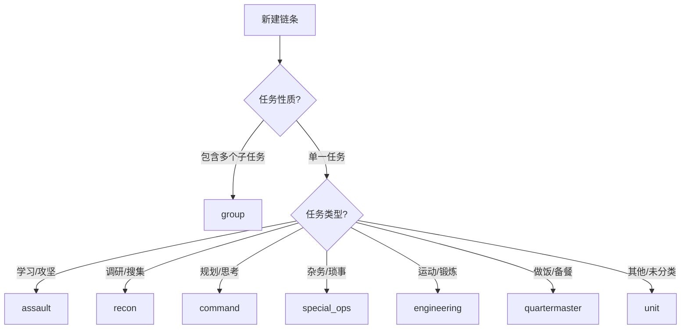

# Chain Types 链条类型说明

本文档详细说明 Momentum 中各种链条类型的设计意图和使用场景。

---

## 类型概览

```typescript
type ChainType =
  | 'unit' // 基础单元
  | 'group' // 任务群容器
  | 'assault' // 突击单元
  | 'recon' // 侦查单元
  | 'command' // 指挥单元
  | 'special_ops' // 特勤单元
  | 'engineering' // 工程单元
  | 'quartermaster'; // 炊事单元
```

---

## 详细说明

### unit - 基础单元

**图标**: 📋
**颜色**: 默认主题色

最基础的链条类型，适用于一般性的专注任务。

**使用场景**:

- 日常工作任务
- 学习阅读
- 未分类的专注活动

**特点**:

- 无特殊行为
- 默认推荐类型

---

### group - 任务群容器

**图标**: 📁
**颜色**: 紫色系

任务群是一种特殊的容器类型，用于组织多个相关的链条。

**使用场景**:

- 项目管理（包含多个子任务）
- 每日routine（包含多个步骤）
- 主题分类（如"学习英语"下包含多个练习）

**特点**:

- 可包含子链条
- 有时间限制（timeLimitHours）
- 支持群组启动时间（groupStartedAt）
- 子链条完成后自动推进

**特有字段**:

```typescript
interface GroupChain {
  type: 'group';
  timeLimitHours: number; // 群组总时限
  groupStartedAt?: Date; // 群组启动时间
  childChainIds?: string[]; // 子链条ID列表
}
```

---

### assault - 突击单元

**图标**: ⚔️
**颜色**: 红色系

用于需要高度集中注意力的学习或实验任务。

**使用场景**:

- 深度学习新知识
- 攻克难题
- 实验性项目
- 需要"攻坚"的任务

**设计意图**:
突击单元的命名来源于军事术语，暗示这是一种需要全力以赴的任务类型。

---

### recon - 侦查单元

**图标**: 🔍
**颜色**: 蓝色系

用于信息搜集和研究类任务。

**使用场景**:

- 市场调研
- 资料搜集
- 技术调研
- 阅读文献

**设计意图**:
侦查单元强调的是"探索"和"发现"，任务目标可能不那么明确，重点在于获取信息。

---

### command - 指挥单元

**图标**: 🎯
**颜色**: 金色系

用于计划制定和决策类任务。

**使用场景**:

- 周计划制定
- 项目规划
- 目标设定
- 策略思考

**设计意图**:
指挥单元是"运筹帷幄"的时间，不做具体执行，而是思考和规划。

---

### special_ops - 特勤单元

**图标**: 🛠️
**颜色**: 灰色系

用于处理杂务和临时任务。

**使用场景**:

- 处理邮件
- 行政事务
- 临时琐事
- 需要快速完成的小任务

**设计意图**:
特勤单元处理那些"必须做但不是核心工作"的事情，帮助用户快速清理杂务。

---

### engineering - 工程单元

**图标**: 💪
**颜色**: 绿色系

用于运动锻炼和身体活动。

**使用场景**:

- 健身锻炼
- 跑步
- 瑜伽
- 任何体育活动

**设计意图**:
工程单元强调"建设身体"，是对身体这个"基础设施"的投资。

---

### quartermaster - 炊事单元

**图标**: 🍳
**颜色**: 橙色系

用于备餐和饮食相关任务。

**使用场景**:

- 做饭
- 备餐
- 烘焙
- 饮食规划

**设计意图**:
炊事单元专门为饮食相关活动设计，因为健康饮食也是生产力的重要组成部分。

---

## 类型选择指南



---

## 类型与功能关系

| 类型          | 支持子链条 | 支持时间限制 | 支持定时器 | 支持例外规则 |
| ------------- | :--------: | :----------: | :--------: | :----------: |
| unit          |     ✗      |      ✗       |     ✓      |      ✓       |
| group         |     ✓      |      ✓       |     ✓      |      ✓       |
| assault       |     ✗      |      ✗       |     ✓      |      ✓       |
| recon         |     ✗      |      ✗       |     ✓      |      ✓       |
| command       |     ✗      |      ✗       |     ✓      |      ✓       |
| special_ops   |     ✗      |      ✗       |     ✓      |      ✓       |
| engineering   |     ✗      |      ✗       |     ✓      |      ✓       |
| quartermaster |     ✗      |      ✗       |     ✓      |      ✓       |

---

## 统计与分析

系统会按类型统计链条使用情况：

```typescript
interface TaskTimeStats {
  // 按类型统计
  byType: {
    [type in ChainType]?: {
      totalTime: number; // 总时间（秒）
      completedCount: number; // 完成次数
      averageTime: number; // 平均时间
    };
  };
}
```

这些统计数据可用于：

1. 了解时间分配
2. 优化任务规划
3. 识别效率瓶颈

---

## 类型定义位置

```typescript
// src/types/index.ts

export const unitChainTypes = [
  'unit',
  'assault',
  'recon',
  'command',
  'special_ops',
  'engineering',
  'quartermaster',
] as const;

export type UnitChainType = (typeof unitChainTypes)[number];
export type ChainType = UnitChainType | 'group';
```

---

## 相关文档

- [DOMAIN_CHAINS.md](../features/DOMAIN_CHAINS.md) - 链条领域详情
- [CHAIN_EDITOR_GUIDE.md](../guides/CHAIN_EDITOR_GUIDE.md) - 编辑器使用指南
- [ARCHITECTURE.md](../guides/ARCHITECTURE.md) - 架构总览
