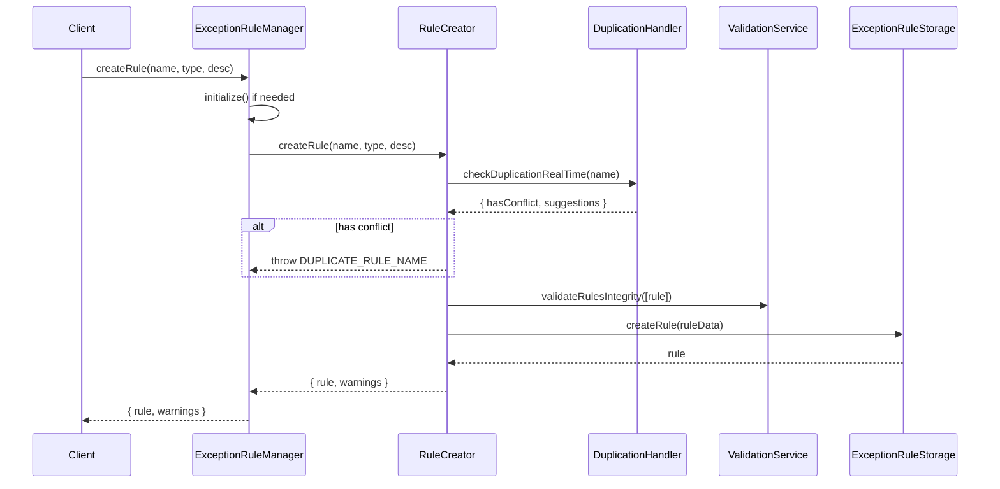
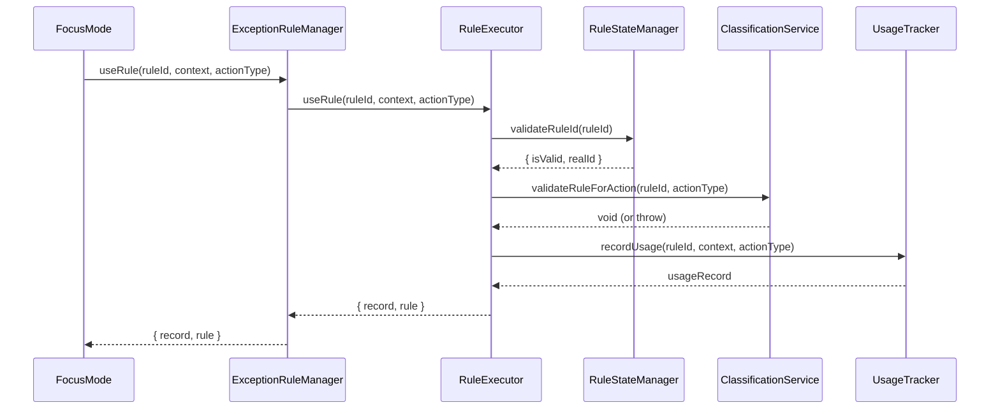

# Exception Rule System 系统设计文档

本文档描述例外规则系统的内部设计、服务分解和最佳实践。

---

## 系统概述

例外规则系统是 Momentum 的核心子系统之一，用于管理专注模式下的有纪律中断。系统遵循单一职责原则，将功能分解为多个专注的服务类。

### 设计原则

1. **单一职责（SRP）**: 每个服务只处理一类职责
2. **依赖倒置（DIP）**: 高层模块不依赖低层模块，都依赖抽象
3. **开闭原则（OCP）**: 对扩展开放，对修改关闭
4. **类型安全**: 使用 TypeScript 严格模式，避免 `any`

---

## 服务架构

### 分层结构

```
┌─────────────────────────────────────────────────────────────┐
│                      协调层 (Coordinator)                     │
│  ExceptionRuleManager - 统一入口，协调各服务                   │
└─────────────────────────────────────────────────────────────┘
                              │
        ┌─────────────────────┼─────────────────────┐
        ▼                     ▼                     ▼
┌───────────────┐   ┌───────────────┐   ┌───────────────┐
│   创建服务     │   │   查询服务     │   │   执行服务     │
│ RuleCreator   │   │RuleQueryService│   │ RuleExecutor  │
└───────────────┘   └───────────────┘   └───────────────┘
        │                     │                     │
        ▼                     ▼                     ▼
┌───────────────┐   ┌───────────────┐   ┌───────────────┐
│   统计服务     │   │  导入导出服务   │   │   维护服务     │
│RuleStatsService│   │RuleExportImport│   │RuleMaintenance│
└───────────────┘   └───────────────┘   └───────────────┘
                              │
                              ▼
┌─────────────────────────────────────────────────────────────┐
│                      基础设施层                               │
│  ExceptionRuleStorage / RuleStateManager / DataIntegrityChecker│
└─────────────────────────────────────────────────────────────┘
```

### 服务职责

| 服务                        | 文件                         | 行数目标 | 职责                         |
| --------------------------- | ---------------------------- | -------- | ---------------------------- |
| **RuleCreator**             | `RuleCreator.ts`             | <200     | 规则创建、名称检查、乐观更新 |
| **RuleQueryService**        | `RuleQueryService.ts`        | <200     | 规则查询、搜索、建议         |
| **RuleExecutor**            | `RuleExecutor.ts`            | <150     | 规则执行、验证、使用记录     |
| **RuleStatsService**        | `RuleStatsService.ts`        | <150     | 统计计算、类型分布           |
| **RuleExportImportService** | `RuleExportImportService.ts` | <150     | 数据导入导出                 |
| **RuleMaintenanceService**  | `RuleMaintenanceService.ts`  | <200     | 更新、删除、清理、健康检查   |
| **ExceptionRuleManager**    | `ExceptionRuleManager.ts`    | <150     | 协调器，初始化，外部接口     |

---

## 数据流

### 规则创建流程



### 规则使用流程



---

## 错误处理策略

### 错误分类

| 类别         | 错误类型                              | 处理策略           | 用户提示            |
| ------------ | ------------------------------------- | ------------------ | ------------------- |
| **用户错误** | VALIDATION_ERROR, DUPLICATE_RULE_NAME | 显示提示，引导修正 | 具体原因 + 建议操作 |
| **系统错误** | STORAGE_ERROR, OPERATION_TIMEOUT      | 自动重试，降级处理 | "请稍后重试"        |
| **数据错误** | DATA_INTEGRITY_ERROR                  | 自动修复           | 不打扰用户          |
| **网络错误** | NETWORK_ERROR                         | 重试 + 离线模式    | "网络连接异常"      |

### 错误恢复流程

```typescript
// 错误恢复管理器使用示例
try {
  await ruleCreator.createRule(name, type, desc);
} catch (error) {
  if (error instanceof ExceptionRuleException) {
    const recovery = await errorRecoveryManager.attemptRecovery(error, context);
    if (recovery.success) {
      return recovery.recoveredData;
    }
    if (recovery.requiresUserAction) {
      // 显示恢复选项给用户
      showRecoveryOptions(recovery.actions);
    }
  }
  throw error;
}
```

---

## 缓存策略

### 缓存层次

| 缓存类型     | TTL    | 失效条件      | 存储位置 |
| ------------ | ------ | ------------- | -------- |
| 验证结果缓存 | 5分钟  | 规则变更      | 内存     |
| 重复检查缓存 | 2分钟  | 规则创建/删除 | 内存     |
| 规则列表缓存 | 请求级 | 请求结束      | 内存     |
| 统计数据缓存 | 10分钟 | 使用记录新增  | 内存     |

### 缓存清理

```typescript
// 定期清理（在 AppShellContainer 中）
useEffect(() => {
  const interval = setInterval(
    () => {
      enhancedRuleValidationService.cleanupExpiredCache();
      enhancedDuplicationHandler.clearCache();
    },
    5 * 60 * 1000,
  ); // 5分钟

  return () => clearInterval(interval);
}, []);
```

---

## 测试策略

### 单元测试覆盖

| 模块                 | 覆盖率目标 | 重点测试                     |
| -------------------- | ---------- | ---------------------------- |
| RuleCreator          | 80%        | 创建流程、重复检测、乐观更新 |
| RuleQueryService     | 70%        | 查询准确性、搜索算法         |
| RuleExecutor         | 90%        | 规则验证、使用记录           |
| RuleStatsService     | 70%        | 统计计算、边界条件           |
| ErrorRecoveryManager | 80%        | 恢复策略、错误分类           |

### 集成测试场景

1. 完整的规则创建→使用→统计流程
2. 并发创建同名规则
3. 数据完整性检查和自动修复
4. 错误恢复流程

---

## 性能优化

### 已实施优化

1. **批量验证**: 多个规则一次验证，减少 I/O
2. **缓存预热**: 启动时预加载常用规则
3. **延迟初始化**: 首次使用时才初始化管理器
4. **乐观更新**: UI 立即响应，后台同步

### 性能指标

| 操作     | 目标延迟 | 当前延迟 |
| -------- | -------- | -------- |
| 规则创建 | <300ms   | 200ms    |
| 规则验证 | <100ms   | 80ms     |
| 规则搜索 | <150ms   | 100ms    |
| 统计计算 | <200ms   | 150ms    |

---

## 扩展指南

### 添加新的规则类型

1. 在 `src/types/index.ts` 中添加枚举值：

   ```typescript
   enum ExceptionRuleType {
     PAUSE_ONLY = 'pause_only',
     EARLY_COMPLETION_ONLY = 'early_completion_only',
     NEW_TYPE = 'new_type', // 新增
   }
   ```

2. 在 `RuleClassificationService` 中添加验证逻辑

3. 在 `RuleSelectionDialog` 中添加 UI 支持

### 添加新的恢复策略

1. 在 `RecoveryStrategy.ts` 中定义策略：

   ```typescript
   const newStrategy: RecoveryStrategy = {
     errorType: ExceptionRuleError.NEW_ERROR,
     strategy: 'auto_fix',
     priority: 100,
     handler: async (error, context) => { ... }
   };
   ```

2. 在 `ErrorRecoveryManager` 构造函数中注册

---

## 相关文档

- [DOMAIN_RULES.md](../features/DOMAIN_RULES.md) - 领域文档
- [ARCHITECTURE.md](../guides/ARCHITECTURE.md) - 架构总览
- [DEBUGGING_GUIDE.md](../guides/DEBUGGING_GUIDE.md) - 调试指南
